# Unit04 Spring AOP 

## AOP 

面向切面(儿)的程序设计（Aspect-oriented programming，AOP，又译作面向方面的程序设计、
剖面导向程序设计），是计算机科学中的一种程序设计思想，旨在将横切关注点与业务主体进行进一
步分离，以提高程序代码的模块化程度。

## AOP 能解决什么问题？

不使用AOP, 业务代码和日志追踪代码 "缠绕"在一起, "日志关注点"散在业务代码中

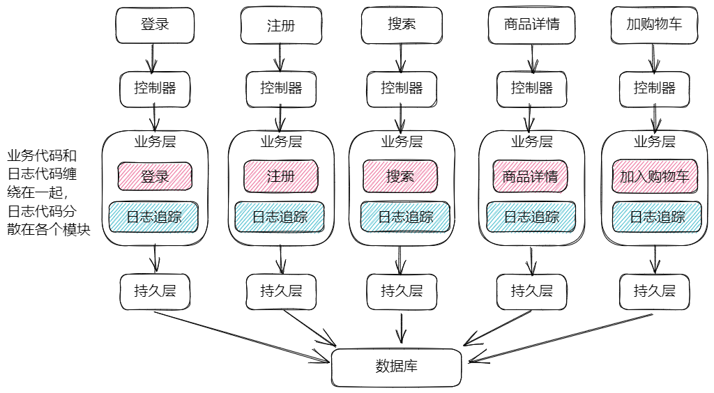

AOP的好处, 将横切关注点独立出来, 统一使用切面组件进行管理

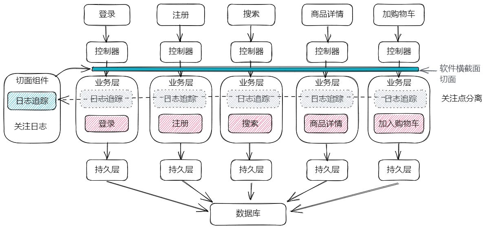

- 面向切面的编程（AOP）实现了横切关注的模块化, 横切关注的代码都在一个地方

- 关注点分离: 如 日志关注点从业务代码中独立出来, 业务模块不用再关心日志问题.

解决了:

- 代码缠绕, 关注点耦合

- 代码分散, 同样的关注分散在各个模块中

## AOP 用途

AOP常用的场合, 示例:
- 日志与跟踪
- 事务管理
- 安全
- 缓存
- 错误处理
- 性能监测 
- 自定义业务规则

## 使用AOP

Spring AOP 使用步骤:

1. 导入包:

   ```xml
   <dependency>
       <groupId>org.springframework.boot</groupId>
       <artifactId>spring-boot-starter-aop</artifactId>
   </dependency>
   ```

   > 导入了 AspectJ 

2. 创建切面组件, 封装横切关注点代码(如: 用户行为日志追踪)

3. 标注通知  @Before

4. 标注切入点 "bean(userServiceImpl)"

5. 在切面中获取用户调用的方法: 连接点(JoinPoint)

   ```java
   @Aspect //切面组件, 注解, 来自 aspectj
   @Component
   public class DemoAspect {
   
       private static Logger logger 
           LoggerFactory.getLogger(DemoAspect.class);
       /**
        * 在 userServiceImpl bean 的方法之前执行 log()
        * @Before 称为 通知
        * bean(userServiceImpl) 称为 切入点
        * JoinPoint: 连接点, 就是当前方法, 连接到的目标方法
        */
       @Before("bean(userServiceImpl)")
       public void log(JoinPoint joinPoint){
           // Signature: 签名, 这里是方法签名
           // 方法签名: 方法名 + 参数列表
           Signature signature = joinPoint.getSignature();
           logger.debug("方法前记录下用户行为:{} 时间执行了 {}",
                   LocalDateTime.now(), signature);
       }
   
   }
   ```

## AOP 核心概念

AOP的执行原理：

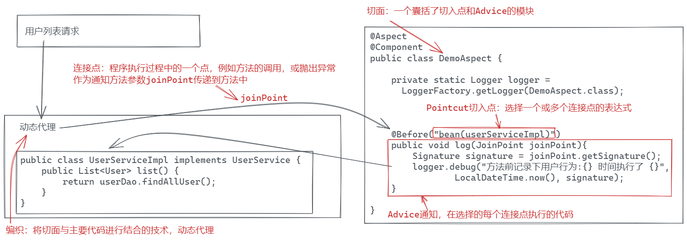

- 连接点(JoinPoint)
  - 程序执行过程中的一个点，例如方法的调用，或抛出异常
  - 就是 AOP 切面的插入点

- 切入点 Pointcut
  - 选择一个或多个连接点的表达式, 告诉AOP, 选择那些切入位置.
  -  bean(personServiceImpl), 选择personServiceImpl Bean 全部方法

- Advice 通知
  - 在选择的每个连接点执行的代码
  - 在连接点的执行代码位置:  
    - @Before  正在切入点之前执行
    - @After  正在切入点之后, 无论是否有异常都执行
    - @AfterThrowing 正在切入点出现异常以后执行
    - @AfterReturning 正在切入点正在实行结束以后执行
    - @Around 环绕通知

- 切面 Aspect
  - 一个囊括了切入点和Advice的模块
  - 是一个类, 包含全部的 切入点, 通知等

- 编织(织入)
  - 将切面与主要代码进行结合的技术, Spring 底层的代码, 采用动态代理技术, 将Aspect嵌入的目标代码

## @Before @After 通知案例

```java
    /**
     * 在 userServiceImpl bean 的方法之前执行 log()
     * @Before 称为 通知
     * bean(userServiceImpl) 称为 切入点
     * JoinPoint: 连接点, 就是当前方法, 连接到的目标方法
     */
    @Before("bean(userServiceImpl)")
    public void log(JoinPoint joinPoint){
        // Signature: 签名, 这里是方法签名
        // 方法签名: 方法名 + 参数列表
        Signature signature = joinPoint.getSignature();
        logger.debug("方法前记录下用户行为:{} 时间执行了 {}",
                LocalDateTime.now(), signature);
    }

    @After("bean(userServiceImpl)")
    public void test(JoinPoint joinPoint){
        Signature signature = joinPoint.getSignature();
        logger.debug("方法后记录下用户行为:{} 时间执行了 {}",
                LocalDateTime.now(), signature);
    }

```

## @AfterReturning 中获取返回值 @AfterThrowing中获取异常信息

```java
/**
 * 获取 切入点方法的返回值
 */
@AfterReturning(value = "bean(userServiceImpl)", returning = "result")
public void test2(JoinPoint joinPoint, Object result){
    Signature signature = joinPoint.getSignature();
    logger.debug("方法正常结束记录下用户行为:{} 时间执行了 {}, 返回值:{}",
            LocalDateTime.now(), signature, result);
}

/**
 * 获取 切入点方法发生的异常
 */
@AfterThrowing(value = "bean(userServiceImpl)", throwing = "e")
public void test3(JoinPoint joinPoint, Exception e){
    Signature signature = joinPoint.getSignature();
    logger.debug("方法异常结束记录下用户行为:{} 时间执行了 {} 异常: {}",
            LocalDateTime.now(), signature, e.getMessage());
}
```


## @Around 环绕通知, 强大的万能通知!

在连接点(JoinPoint)环绕执行

 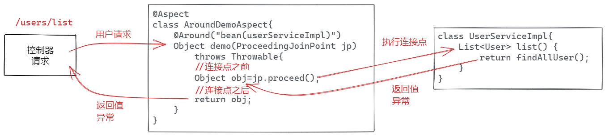

@Around 可以替代: @Before @After 等全部通知

```java
@Aspect
@Component
public class AroundTestAspect {

    Logger logger = LoggerFactory.getLogger(AroundTestAspect.class);

    @Around("bean(userServiceImpl)")
    public Object test(ProceedingJoinPoint joinPoint)
        throws Throwable{
        Signature signature = joinPoint.getSignature();

        try {
            logger.debug("在{}方法之前", signature);
            //方法之前执行
            Object result = joinPoint.proceed();
            //方法之后执行
            logger.debug("在{}正常方法之后，返回{}", signature, result);
            return result;
        }catch (Throwable e){
            logger.debug("在{}方法出现异常{}时候执行", signature, e.getMessage());
            throw e;
        }finally {
            //无论是否有异常都会执行
            logger.debug("在{}方法之后", signature);
        }
    }
}
```

使用注意事项:

- @Around 的连接点类型 ProceedingJoinPoint, 表示被执行是方法
- joinPoint.proceed() 表示执行连接点方法
  - 如果不执行, 就意味着连接点方法被放弃! 这种行为可能是一个有害行为
    - 一般都是要执行

  - joinPoint.proceed() 的返回值是连接方法的返回值, 原则上要作为当前方法的返回值
    - 可以在AOP方法中对这个返回值进行加工处理, 不过这个可能是危险行为!

  - joinPoint.proceed() 的异常就是连接点方法执行异常, 如果进行拦截处理, 就意味着影响异常处理流程. 

- @Around 的功能强大, 可以处理返回值, 可以处理异常, 可以在切入点方法前嵌入代码, 可以在切入点方法之后嵌入代码. 
- 请谨慎使用 @Around 

> Spring MVC 的统一异常处理 @RestControllerAdvice 就是利用AOP 实现的!

## 例子: 记录业务执行时间

评估一个软件系统的性能? 测试每个业务方法的执行时间, 时间长性能不好.

```java
/**
 * 拦截测试 业务层性能
 */
@Aspect
@Component
public class DurationAspect {

    private static final Logger logger = 
        LoggerFactory.getLogger(DurationAspect.class);

    @Around("bean(userServiceImpl)")
    public Object test(ProceedingJoinPoint joinPoint) throws Throwable{
        Signature signature = joinPoint.getSignature();
        long t1 = System.currentTimeMillis();
        Object value = joinPoint.proceed(); //执行 连接点 目标方法
        long t2 = System.currentTimeMillis();
        logger.debug("方法{}执行时间{}", signature, t2-t1);
        return value;
    }
}
```


## @Pointcut  统一管理切入点

- 使用@Pointcut定义一个切入点表达式, 将切入点表达式绑定到一个 方法名称
- 其他通知, 只需要绑定方法名称即可
- 优势: 当切入点表达式复杂时候, 可以统一管理, 避免反复书写

```java
@Aspect //切面组件, 注解, 来自 aspectj
@Component
public class TestAspect {

    private static Logger logger = 
            LoggerFactory.getLogger(TestAspect.class);

    /**
     *  @Pointcut 统一管理切入点
     * - 定义一个切入点表达式
     * - 将切入点表达式绑定到一个 名称(方法名)
     * - 其他通知, 只需要绑定方法名称即可
     */
    @Pointcut("bean(userServiceImpl)")
    public void userService(){}
  
    @Before("userService()")
    public void log(JoinPoint joinPoint){
        // Signature: 签名, 这里是方法签名
        // 方法签名: 方法名 + 参数列表
        Signature signature = joinPoint.getSignature();
        logger.debug("方法前记录下用户行为:{} 时间执行了 {}",
                LocalDateTime.now(), signature);
    }

    @After("userService()")
    public void test(JoinPoint joinPoint){
        Signature signature = joinPoint.getSignature();
        logger.debug("方法后记录下用户行为:{} 时间执行了 {}",
                LocalDateTime.now(), signature);
    }

    /**
     * 获取 切入点方法的返回值
     */
    @AfterReturning(value = "userService()", returning = "result")
    public void test2(JoinPoint joinPoint, Object result){
        Signature signature = joinPoint.getSignature();
        logger.debug("方法正常结束记录下用户行为:{} 时间执行了 {}, 返回值:{}",
                LocalDateTime.now(), signature, result);
    }

    /**
     * 获取 切入点方法发生的异常
     */
    @AfterThrowing(value = "userService()", throwing = "e")
    public void test3(JoinPoint joinPoint, Exception e){
        Signature signature = joinPoint.getSignature();
        logger.debug("方法异常结束记录下用户行为:{} 时间执行了 {} 异常: {}",
                LocalDateTime.now(), signature, e.getMessage());
    }
}
```

## 切入点表达式

execution: 执行

- execution(<方法模式>) 该方法必须匹配模式规则
- 可以串联起来创建复合切入点 
  - &&（与），||（或），!（非）
  - 如: execution(<方法模式1>) || execution(<方法模式2>)

- 方法模式
  - [修饰符] 返回类型 [类的类型]方法名称(参数列表) [throws 异常类型]

- 匹配模式(匹配规则)

  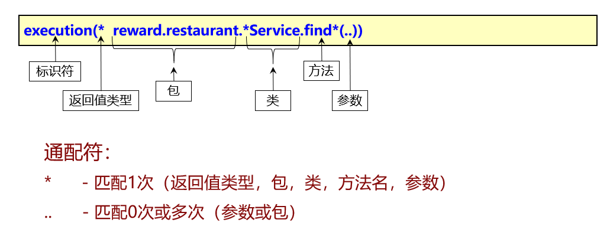

  上述表达式可以匹配如下方法:

  User reward.restaurant.UserService.findUserById(int id)

  User reward.restaurant.UserService.findUserByName(String name)

  List  reward.restaurant.UserService.findUsers()

  List  reward.restaurant.UserService.findUsers(int id, int age)

  List reward.restaurant.FoodService.findFoods(String name)

  不能匹配的方法

  List  reward.restaurant.UserService.listUsers()

- 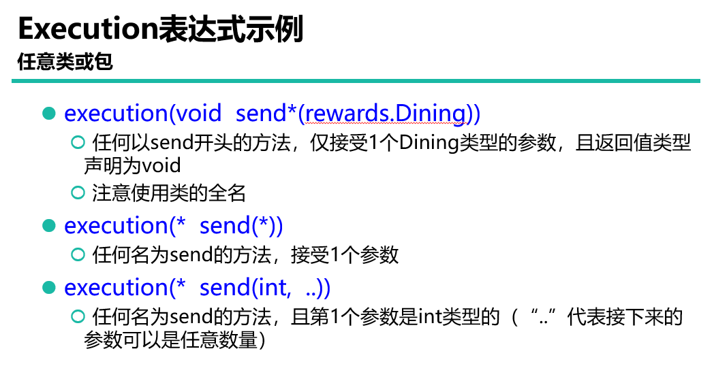
- 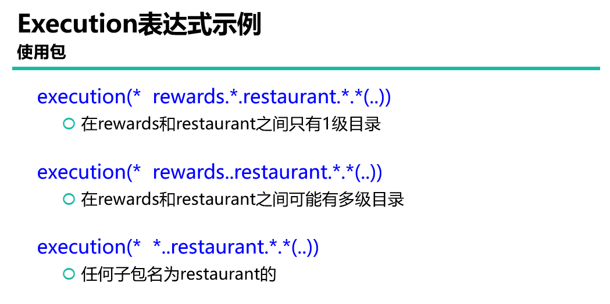
- 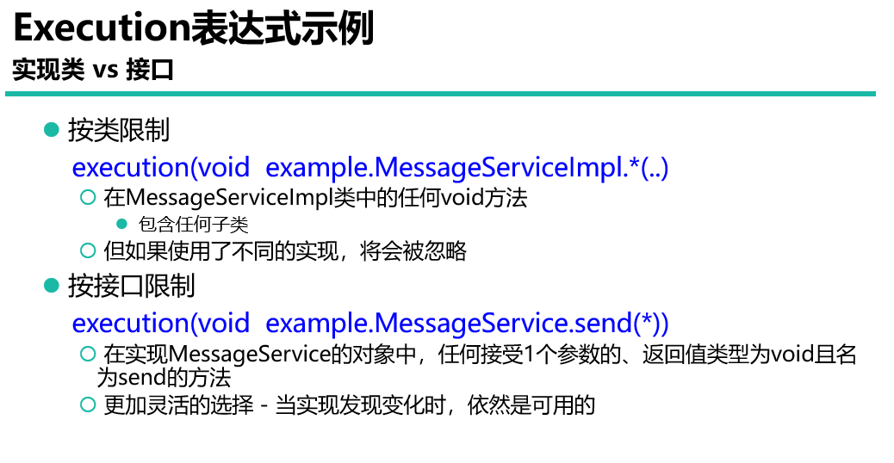

- 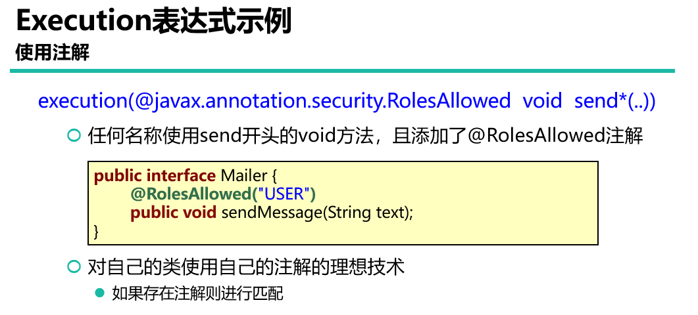
- 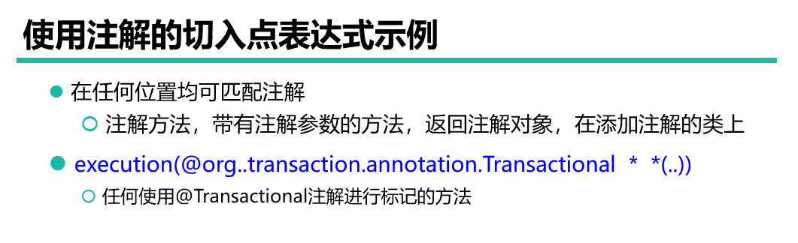

> 提示:  Spring 声明式事务处理, 就是利用AOP实现, 采用的就是基于注解的模式匹配.

## 织入原理(AOP原理): 动态代理

动态代理: 在不改变原有类功能的情况下, 为类扩展功能.

Spring 使用 动态代理 实现代码的织入

- JDK 动态代理: 基于接口的动态代理
- CGLib 动态代理: 基于类的动态代理

### 代理模式

一个例子：利用编码方式将ArrayList转换为线程安全的类型。

设计思路：

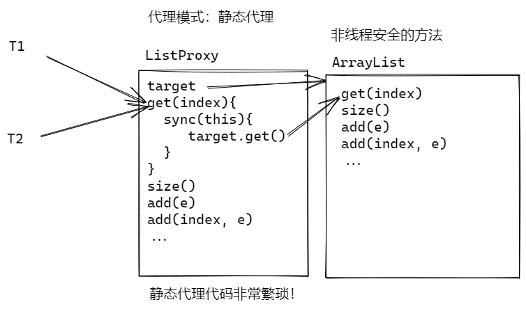

```java
public class ListProxy<E> implements List<E> {
    private List<E> target;

    public ListProxy(){
        target = new ArrayList<>();
    }

    @Override
    public boolean add(E e) {
        synchronized (this) {
            return target.add(e);
        }
    }

    @Override
    public E get(int index) {
        synchronized (this) {
            return target.get(index);
        }
    }


    @Override
    public int size() {
        synchronized (this) {
            return target.size();
        }
    }

    @Override
    public String toString() {
        synchronized (this) {
            return target.toString();
        }
    }

    @Override
    public boolean isEmpty() {
        synchronized (this) {
            return target.isEmpty();
        }
    }

    @Override
    public boolean contains(Object o) {
        synchronized (this) {
            return target.contains(o);
        }
    }

    @Override
    public Iterator<E> iterator() {
        synchronized (this) {
            return target.iterator();
        }
    }

    @Override
    public Object[] toArray() {
        synchronized (this) {
            return target.toArray();
        }
    }

    @Override
    public <T> T[] toArray(T[] a) {
        synchronized (this) {
            return target.toArray(a);
        }
    }


    @Override
    public boolean remove(Object o) {
        synchronized (this){
            return target.remove(o);
        }
    }

    @Override
    public boolean containsAll(Collection<?> c) {
        synchronized (this) {
            return target.containsAll(c);
        }
    }

    @Override
    public boolean addAll(Collection<? extends E> c) {
        synchronized (this) {
            return target.addAll(c);
        }
    }

    @Override
    public boolean addAll(int index, Collection<? extends E> c) {
        synchronized (this) {
            return target.addAll(index,c);
        }
    }

    @Override
    public boolean removeAll(Collection<?> c) {
        synchronized (this) {
            return target.removeAll(c);
        }
    }

    @Override
    public boolean retainAll(Collection<?> c) {
        synchronized (this) {
            return target.retainAll(c);
        }
    }

    @Override
    public void clear() {
        synchronized (this){
            target.clear();
        }
    }

    @Override
    public E set(int index, E element) {
        synchronized (this) {
            return target.set(index, element);
        }
    }

    @Override
    public void add(int index, E element) {
        synchronized (this){
            target.add(index, element);
        }
    }

    @Override
    public E remove(int index) {
        synchronized (this) {
            return target.remove(index);
        }
    }

    @Override
    public int indexOf(Object o) {
        synchronized (this) {
            return target.indexOf(o);
        }
    }

    @Override
    public int lastIndexOf(Object o) {
        synchronized (this) {
            return target.lastIndexOf(o);
        }
    }

    @Override
    public ListIterator<E> listIterator() {
        synchronized (this) {
            return target.listIterator();
        }
    }

    @Override
    public ListIterator<E> listIterator(int index) {
        synchronized (this) {
            return target.listIterator(index);
        }
    }

    @Override
    public List<E> subList(int fromIndex, int toIndex) {
        synchronized (this) {
            return target.subList(fromIndex, toIndex);
        }
    }

}
```

测试：

```java
public class ListProxyTest {
    public static void main(String[] args) {
        ListProxy<String> list = new ListProxy<>();
        list.add("Tom");
        list.add("Jerry");
        System.out.println(list);
        System.out.println(list.get(1));
    }
}
```

显然 静态代理方式，非常繁琐：

### JDK动态代理

动态代理相对于静态代理会简化许多， 原理如下：

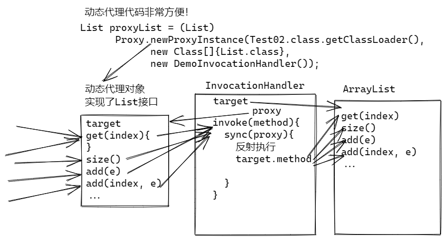

代码：

```java
public class ListHandler<E> implements InvocationHandler {
    private List<E> target;
    public ListHandler(){
        target = new ArrayList<>();
    }
    @Override
    public Object invoke(Object proxy, Method method, Object[] args)
            throws Throwable {
        synchronized (proxy) {
            System.out.println(method);
            //反射调用方法
            return method.invoke(target, args);
        }
    }
}
```

```java
public class ListProxyTest2 {
    public static void main(String[] args) {
        List<String> listProxy = (List<String>)
        Proxy.newProxyInstance(ListProxyTest2.class.getClassLoader(),
                new Class[]{List.class},
                new ListHandler<>());
        listProxy.add("Tom");
        listProxy.add("Andy");
        System.out.println(listProxy);
        System.out.println(listProxy.get(1));
        System.out.println(listProxy.getClass().getName());
    }
}
```

使用动态代理为业务层扩展功能：

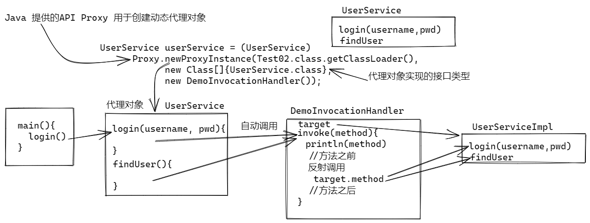

模拟业务层：

```java
public interface UserService {
    boolean login(String username, String pwd);
    String findUser(Integer id);
}
```

```java
public class UserServiceImpl implements UserService{
    @Override
    public boolean login(String username, String pwd) {
        if("Tom".equals(username) && "123".equals(pwd)){
            System.out.println("登录成功");
            return true;
        }
        System.out.println("登录失败");
        return false;
    }

    @Override
    public String findUser(Integer id) {
        return null;
    }
}
```

JDK动态代理：

- Java 提供核心API, 性能最好, 兼容性好
- 必须依赖接口, 实现动态代理

使用JDK动态代理:

```java
public class DemoInvocationHandler implements InvocationHandler {
    private UserService target;
    public DemoInvocationHandler(UserService target){
        this.target = target;
    }
    @Override
    public Object invoke(Object proxy, Method method, Object[] args)
            throws Throwable {
        System.out.println(method);
        System.out.println("业务方法之前");
        Object value = method.invoke(target, args);
        System.out.println("业务方法之后");
        return value;
    }
}
```

```java
public class Test02 {
    public static void main(String[] args) {
        UserService userService = (UserService)
            Proxy.newProxyInstance(Test02.class.getClassLoader(),
                new Class[]{UserService.class},
                new DemoInvocationHandler(new UserServiceImpl()));
        userService.findUser(1);
        userService.login("Jerry", "123");
        System.out.println(userService.getClass().getName());
    }
}
```


### CGLib 动态代理

- 是三方提供, 基于asm动态代码动态代码生成, 性能稍差, 兼容性一般
- 依赖类,实现动态代理, 不需要接口.

- 灵活性高

原理：

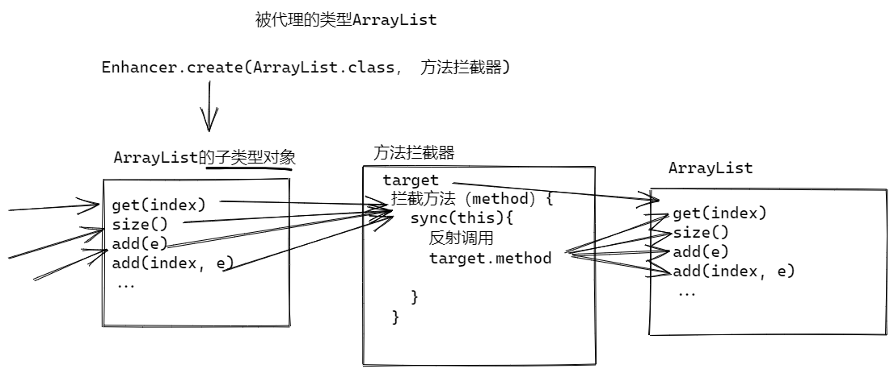


使用CGLIB解决ArrayList线程安全问题：

```java
/**
 * 方法拦截器
 */
public class ArrayListInterceptor<E> implements MethodInterceptor {
    private ArrayList<E> target;
    public ArrayListInterceptor(){
        target = new ArrayList<>();
    }

    @Override
    public Object intercept(
            Object proxy, Method method, Object[] args,
            MethodProxy methodProxy) throws Throwable {
        synchronized (proxy) {
            System.out.println(method);
            Object value = method.invoke(target, args);
            return value;
        }
    }
}
```

```java
public class CglibProxyListDemo {
    public static void main(String[] args) {
        //使用Cglib创建ArrayList类型的代理对象
        ArrayList<String> proxyList = (ArrayList<String>)
            Enhancer.create(ArrayList.class, new ArrayListInterceptor<String>());
        proxyList.add("Tom");
        proxyList.add("Wang");
        System.out.println(proxyList);
        System.out.println(proxyList.get(1));
        System.out.println(proxyList.getClass().getName());
    }
}
```

使用CGLIB为业务层增加功能：

```java
public class UserServiceInterceptor implements MethodInterceptor {
    private UserServiceImpl targer;
    public UserServiceInterceptor(UserServiceImpl userService){
        targer = userService;
    }

    @Override
    public Object intercept(Object o,
                            Method method, Object[] args,
                            MethodProxy methodProxy) throws Throwable {
        System.out.println(method);
        System.out.println("方法之前扩展功能");
        Object value = method.invoke(targer, args);
        System.out.println("方法之后扩展功能");
        return value;
    }
}
```

```java
public class UserServiceCglibTest {
    public static void main(String[] args) {
        UserServiceImpl userService = (UserServiceImpl)
            Enhancer.create(UserServiceImpl.class,
                new UserServiceInterceptor(new UserServiceImpl()));
        userService.findUser(1);
        userService.login("Tom", "123");
    }
}
```


## 经典面试题目: Spring AOP 和动态代理的关系

- Spring  AOP 底层就是利用动态代理, 将 切面 "织入" 到 AOP代码中
- Spring Boot 首选 CGBLib动态代理
- 动态代理可以实现全部AOP功能
- AOP 就是封装好的 动态代理, 使用比动态代理更加简单

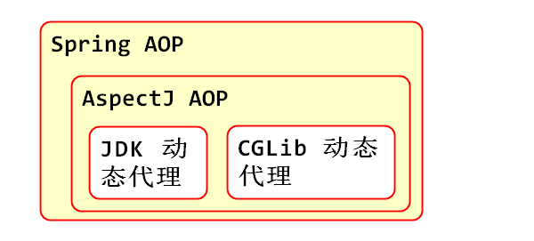

### 经典面试题目: AOP Spring 动态代理规则

- Spring 动态代理(首选选择JDK代理):
  - 如果目标对象有接口, 就使用JDK动态代理
  - 如果目标对象没有接口, 就使用 CGLib动态代理
- SpringBoot 2 以后(首选CGLib动态代理): 
  - 首选CGLib动态代理
  - 可以在配置文件application.properties中设置为, 首选JDK动态代理
    -  spring.aop.proxy-target-class=false

简单理解: Spring 首选 JDK 动态代理, SpringBoot 2 首选 CGLib动态代理

## 经典面试题目: AOP 的使用场景

- 日志与跟踪

- 事务管理

- 安全

- 缓存

- 错误处理

- 性能监测

