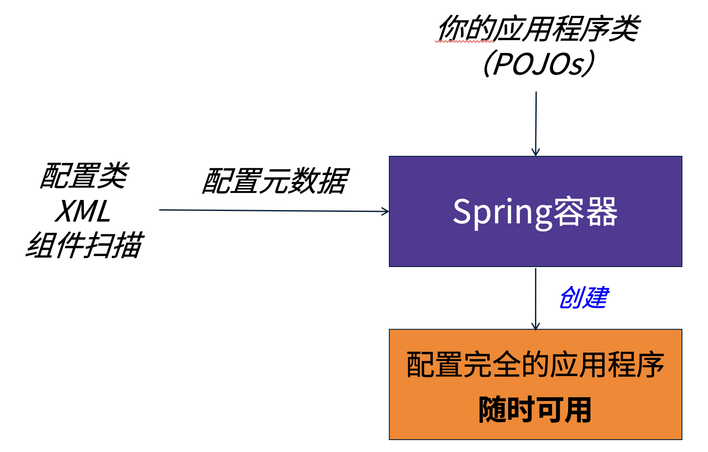

# Spring IOC/DI Day01

## Spring

Spring 核心功能：IOC和AOP

IOC： 控制反转
AOP： 面向切面编程

## Spring Boot 中使用日志

Spring Boot 提供了日志支持，使用非常方便
- 控制台输出语言 System.out.println() 是IO操作，性能很差，使用过多会严重影响系统性能
- 日志系统提供了高性能缓存机制，有着很好的性能，并且可以使用配置进行统一打开和关闭
- Spring Boot 整合了日志系统，简单配置就可以使用。

使用日志：
1. 在需要日志输出的类中创建日志对象 logger
   `private static Logger logger = LoggerFactory.getLogger(LoggerTests.class);`
   - 其中 使用static好处是方便在静态方法调用
   - Logger和LoggerFactory 来自org.slf4j包
   - 方法参数是当前的类名，用于设置Logger的层级，方便分组管理，分组打开和关闭
2. 需要输出信息时候，使用logger的日志方法输出信息
   - 如果一般信息就使用 debug()
   - 如果是严重故障就使用 error() 
   - 使用{}占位符输出变量信息
3. 在application.properties 文件中设置日志门槛
    `logging.level.cn.tedu.springioc = debug`
   - 默认的日志级别是info
   - cn.tedu.springioc 是开启日志的包或者类，可以粗粒度设置到包，或者细粒度的类
   - 门槛级别用于控制日志的输出
   - 当前的设置为： cn.tedu.springioc包和子包中的日志输出语句高于debug级别的信息会被输出。

```java
@SpringBootTest
public class LoggerTests {
    private static Logger logger = LoggerFactory.getLogger(LoggerTests.class);

    @Test
    void debug() {
        logger.debug("Hello World!");
    }

    @Test
    void info() {
        logger.info("普通信息");
    }

    @Test
    void warn() {
        logger.warn("警告信息");
    }

    @Test
    void error() {
        logger.error("错误信息");
    }

    @Test
    void value() {
        logger.debug("今天时间 {}, {}", LocalDateTime.now(), "OK");
    }
}
```

```properties
logging.level.cn.tedu.springioc = debug
```

常见的日志等级划分方式如下：

- FATAL：致命等级的日志，指发生了严重的会导致应用程序退出的事件。
- ERROR：错误等级的日志，指发生了错误，但是不影响系统运行。
- WARN： 警告等级的日志，指发生了异常，可能是潜在的错误。
- INFO： 信息等级的日志，指一些在粗粒度级别上需要强调的应用程序运行信息。
- DEBUG：调试等级的日志，指一些细粒度的对于程序调试有帮助的信息。
- TRACE：跟踪等级的日志，指一些包含程序运行详细过程的信息。

## 使用组件扫描隐式创建对象

隐式创建对象：
1. 在SpringBoot包的子包中类上标注@Compoment
2. 使用时候使用@Autowired注入组件
3. Spring Boot在启动时候会自动创建Bean组件， 这种方式被称为隐式创建对象
> 复习内容

```java
@Component
public class DemoBean {
    @Override
    public String toString() {
        return "demoBean";
    }
}
```

```java
@SpringBootTest
public class ComponentTests {
    Logger logger = LoggerFactory.getLogger(ComponentTests.class);

    @Autowired
    DemoBean demoBean;

    @Test
    void demoBean(){
        logger.debug("{}", demoBean);
    }
}
```


## @Bean注解显示定义Bean

如果需要使用第三方是组件就不能在源码上标注@Component，也就不能使用组件扫描功能了。
Spring提供了@Bean注解，在Spring 配置类中声明Java Bean。这种方式被称为"显示定义Bean"



使用方式：
1. 在组件扫描的子包中创建一个配置类， 配置类上标注@Configuration
2. 定义创建组件的方法， 在方法上标注@Bean
3. Spring Boot 在启动时候，会自动扫描到配置类，创建Java Bean
4. 声明Bean对象的方法名就是组件的默认ID，可以用于解决歧义问题
5. 可以设置@Bean的属性设置BeanID

```java

@Configuration
public class ConfigBeans {

   /**
    * 使用@Bean 显示声明Java Bean 组件
    * Bean ID 为 names
    * @return 创建的JavaBean
    */
   @Bean
   public ArrayList<String> names(){
      ArrayList<String> names = new ArrayList<>();
      names.add("Tom");
      names.add("Jerry");
      return names;
   }

   @Bean
   public ArrayList<String> mobilePhone(){
      ArrayList<String> list = new ArrayList<>();
      list.add("110");
      list.add("119");
      return list;
   }

   /**
    * 使用 @Bean的属性设置BeanID
    * @return 城市列表
    */
   @Bean("cities")
   public ArrayList<String> list(){
      ArrayList<String> list = new ArrayList<>();
      list.add("北京");
      list.add("上海");
      return list;
   }
}
```

```java
@SpringBootTest
public class BeanTests {

   Logger logger = LoggerFactory.getLogger(BeanTests.class);

   @Autowired
   @Qualifier("cities")
   ArrayList<String> names;

   @Test
   void names() {
      logger.debug("{}", names);
   }
}
```

## 使用 ApplicationContext 获取Bean

ApplicationContext 直接翻译为应用程序上下文：
- 是Spring的核心，简单理解ApplicationContext就是Spring容器
- 所有IOC管理的JavaBean组件都在ApplicationContext对象中
- 可以通过ApplicationContext的API方法获取任何被Spring管理的Bean对象
- 有两种获取 ApplicationContext 方式
   - SpringApplication.run(ConfigBeans.class);
   - 注入 ApplicationContext
   

案例：
```java
public class Demo01 {
    public static void main(String[] args) {
        ApplicationContext context = 
                SpringApplication.run(ConfigBeans.class);
        List<String> list  = context.getBean("names", 
                ArrayList.class);
        System.out.println(list);
    }
}
```

```java
@SpringBootTest
public class ApplicationContextTests {

    @Autowired
    ApplicationContext context;

    @Test

    void context(){
        List<String> list = context.getBean("names", List.class);
        System.out.println(list);
    }
}
```
## Spring Boot 自动组件扫描

Spring Boot 会自动开启组件扫描功能：
- 扫描启动类的当前包或者子包中的注解，并且创建对象
  -  @ComponentScan Spring Boot 会自动配置 这个组件扫描注解

- 如果 Java Bean 没有定义在当前包和子包中则扫描不到
- 如果 Bean 创建到其他位置（不是当前包和子包）则需要手动配置组件扫描
- 如果在启动类上配置了组件扫描，则会关闭自动组件扫描

注意： @Component 注解需要和 @ComponentScan 注解一起使用才可以

```java
package cn.test.bean;

import org.springframework.stereotype.Component;

@Component
public class ExampleBean {
    @Override
    public String toString() {
        return "exampleBean";
    }
}
```

```java
@ComponentScan({"cn.tedu.service","cn.test.bean"})
```

```java
@SpringBootTest
public class ExampleBeanTests {

    Logger logger = LoggerFactory.getLogger(ExampleBeanTests.class);

    @Autowired
    ExampleBean exampleBean;

    @Test
    void exampleBean(){
        logger.debug("{}", exampleBean);
    }

}
```

### 关于组件扫描范围

组件扫描范围不能过大，如果扫描范围过大启动时候会变慢，严重情况下会慢几秒。
最佳的方式是减少扫描范围，提升扫描效率：

- 很糟：`@ComponentScan({"org", "com"})`
- 仍然很糟： `@ComponentScan("org")`
- 还行：`@ComponentScan("com.bank.app")`
- 不错：`@ComponentScan({"com.bank.app.repository", "com.bank.app.service")})`

> 扫描多个包使用静态数组作为参数：{"com.bank.app.repository", "com.bank.app.service")}


### @Bean 和 @Component 用途区别

@Bean显示配置Bean
- 优点：
    - 集中在一个（或几个）地方，方便统一管理Bean
    - 编写任何你需要的Java代码，可以在配置类中自定义初始化程序
    - 可以对配置类进行单元测试，可以单独测试
    - 可用于所有类（不只是你自己的类）
- 缺点：
    - 比@Component注解更加冗余，繁琐

@Component 隐式配置Bean，对你自己的Bean类非常友好，适合自己定义的Java类
- 优点：
    - 编辑位置单一（就在类中）
    - 适合非常快速的开发，直接标注在源码上，很方便
- 缺点：
    - 配置分布在你的代码库中
    - 不方便，难以调试/维护
    - 只适用于你自己的代码

建议显式配置与隐式配置的混合使用，可以通过多种方式进行混合
- 使用隐式@Component配置
    - **你自己的类：配置@Component简单方便**
- @Bean显式配置用于：
    - **别人写好的类，添加注解的第三方Bean，使用@Bean方式配置**
    - 不能修改的遗留代码
    - 当在单一位置管理配置的时候


## Bean的作用域

Bean的作用域就是指Spring中Java Bean 有效范围，

- 默认的作用域是单例的（singleton）：任何时候获得的Bean对象都是同一个实例
- 原型作用域“*prototype*”：每次引到bean时都会创建新的实例

其他作用域（了解）：

| 作用域      | 描述                                                         |
| ----------- | ------------------------------------------------------------ |
| singleton   | 持续时间与 **ApplicationContext**  一致                      |
| prototype   | 每次调用 **getBean**()  都会返回一个新的对象  持续时间与持有引用的时间一致，没有引用后，会被作为垃圾而回收 |
| session     | 持续时间与用户的HTTP会话一致  （Web 环境）                   |
| request     | 持续时间与用户的HTTP请求一致  （Web 环境）                   |
| application | 持续时间与ServletContext一致（Spring  4.0）                  |
| global      | 持续时间与Portlet应用程序中的全局HttpSession一致（*从**Spring 5**开始过期*） |
| thread      | 持续时间与所在的线程一致，在Spring中已定义，但默认*未注册*   |
| websocket   | 持续时间与websocket一致（Spring  4.2）                       |
| refresh     | 可以超过其application  context的重新加载时间  难以确保效果，假设*Spring Cloud**配置服务器* |

组件扫描案例：

```java
@Component
@Scope("singleton")
public class SingletonBean {
    @Override
    public String toString() {
        return "SingletonBean";
    }
}
```

```java
@Component
@Scope("prototype")
public class PrototypeBean {
    @Override
    public String toString() {
        return "PrototypeBean";
    }
}
```

```java
@Autowired
ApplicationContext context;

@Test
void singleton(){
    SingletonBean bean1 = context.getBean(SingletonBean.class);
    SingletonBean bean2 = context.getBean(SingletonBean.class);
    SingletonBean bean3 = context.getBean(SingletonBean.class);

    logger.debug("{}", bean1);
    logger.debug("bean1 和 bean2 是否是同一个对象{}", bean1==bean2);
    logger.debug("bean1 和 bean3 是否是同一个对象{}", bean1==bean3);
}

@Test
void prototype(){
    PrototypeBean bean1 = context.getBean(PrototypeBean.class);
    PrototypeBean bean2 = context.getBean(PrototypeBean.class);
    PrototypeBean bean3 = context.getBean(PrototypeBean.class);

    logger.debug("{}", bean1);
    logger.debug("bean1 和 bean2 是否是同一个对象{}", bean1==bean2);
    logger.debug("bean1 和 bean3 是否是同一个对象{}", bean1==bean3);
}
```

显示声明@Bean的案例：

```java
@Configuration
public class ScopeConfig {

    @Bean
    public List<String> provinceNames() {
        List<String> provinceNames = new ArrayList<>();
        provinceNames.add("北京");
        provinceNames.add("上海");
        return provinceNames;
    }

    @Bean
    @Scope("prototype")
    public List<String> holidayNames() {
        List<String> list = new ArrayList<>();
        list.add("中秋");
        list.add("国庆");
        return list;
    }
}
```

```java
@Test
void beanScope(){
    List<String> provinceNames1 = context.getBean("provinceNames", List.class);
    List<String> provinceNames2 = context.getBean("provinceNames", List.class);
    logger.debug("{}", provinceNames1);
    logger.debug("省份列表是否为单例：{}", (provinceNames2 == provinceNames1));

    List<String> holidayNames1 = context.getBean("holidayNames", List.class);
    List<String> holidayNames2 = context.getBean("holidayNames", List.class);
    logger.debug("{}", holidayNames1);
    logger.debug("省份列表是否为单例：{}", (holidayNames1 == holidayNames2));
}
```

## @Autowired注入 和 @Resource注入

### @Autowired注入

- @Autowired注解是Spring框架提供的注解
- @Autowired默认是根据类型来匹配的
- @Autowired注入方式-3种
    - 构造方法注入（推荐的做法），必须存在唯一的匹配**类型**的依赖，只有一个构造器时候可以省略
    - set方法注入（不是Set方法也可以），构造方法注入和setter注入均支持多参数注入
    -  字段注入（对象属性注入），即便是private字段也可以注入，Spring 5 会有警告
- @Autowired依赖：默认是必须！
    - 使用required属性覆盖默认行为**@Autowired**(required=**false**)

### **@Autowired**注入歧义问题

若注入的类型对应的实例存在多个，则编译报错/运行时报错，解决办法有2种：

- 注入对象的名称对应某个bean ID，则可以注入成功

@Autowired的注入机制：

- 先根据类型匹配
    - 若没有匹配类型，报错
    - 有匹配类型，对应的实例有1个，则注入
    - 有匹配类型，对应的实例有多个，则自动根据name匹配
- 根据name匹配（就是根据BeanID匹配）
    - 如果name匹配成功就注入，如果根据名称匹配失败则报错

可以添加@Qualifer注解指定beanID


```java
@Component
public class Axe implements Tool{
    @Override
    public String toString() {
        return "开天斧";
    }
}
```

```java
@Component
public class Saw implements Tool{
    @Override
    public String toString() {
        return "寒冰锯";
    }
}
```

```java
@Component
public class Worker {
    Logger logger = LoggerFactory.getLogger(Worker.class);
    private String name = "光头强";

    @Autowired
    @Qualifier("saw")
    private Tool tool;

    public Worker() {
    }

    public void work(){
        logger.debug("{}使用{}砍树", name, tool);
    }
}
```

```java
@SpringBootTest
public class DITests {

    @Autowired
    Worker worker;

    @Test
    void worker() {
        worker.work();
    }
}
```

### **关于@Resource**

来自JSR-250，能被EJB 3.0和Spring支持

- 默认根据名称，而不是默认按类型来识别依赖项，名称是Spring的Bean名称
    - 根据属性/字段的名称进行推断
    - 若找不到匹配的name,则直接回退到根据类型注入

- @Autowired是先根据类型来匹配的

- 仅支持Setter和字段注入

简单理解：@Autowired 和 @Resource区别

- 注入匹配规则不同：
  - @Autowired 先匹配类型， 在匹配名称， @Resource先匹配名称， 再匹配类型。
- 支持的注入方式不同：
  - @Autowired： 属性 方法 构造器（只有一个构造器时候， 可以省略）
  - @Resource：  属性 方法
- 注解来源不同：
  - @Autowired Spring 提供
  - @Resource Java提供
- @Autowired 包含必须输入功能！

推荐使用 @Autowired ！！！

## 组合注解和 Meta注解（元注解）

Java 中多个注解可以组合拼接为一个新注解

- 拼接的新注解成为 组合注解
- 没有参与拼接的注解成为 元注解
- 新注解具备全部全部元注解的功能

@Service注解的源码：

```java
@Target({ElementType.TYPE})
@Retention(RetentionPolicy.RUNTIME)
@Documented
@Component
public @interface Configuration {
   @AliasFor(annotation = Component.class)
   String value() default "";
}
```


为何Spring搞组合注解？为了表示合理的业务意义：

- Component ： 组件

- Configuration： 配置 

- Service： 服务

- Controller:  控制器 

  

组合注解都有和 @Component 相同的功能：


```java
@Service
public class UserService {
    @Override
    public String toString() {
        return "UserService";
    }
}
```

```java
@SpringBootTest
public class UserServiceTests {
    Logger logger = LoggerFactory.getLogger(UserServiceTests.class);

    @Autowired
    UserService userService;

    @Test
    void userService(){
        logger.debug("Service {}", userService);
    }
}
```
Spring 提供了创建Bean组件的组合注解


这些组合注解都有和 @Component 类似的功能

- @Service 用在业务层组件
- @Repository 用在数据访问层组件
- @Controller 和 @RestController 用在 Spring MVC 控制器
- @Configuration 用在Spring Java 配置累上


甚至可以自定义自己的组合注解。

```java
@Component
@Retention(RetentionPolicy.RUNTIME)
@Target(ElementType.TYPE)
public @interface MyService {
}
```

```java
@MyService
public class UserService {
    @Override
    public String toString() {
        return "UserService";
    }
}
```

注意： 组合注解和元注解都是相对概念， 一个组合注解也可以作为元注解，再次组合为新注解。
