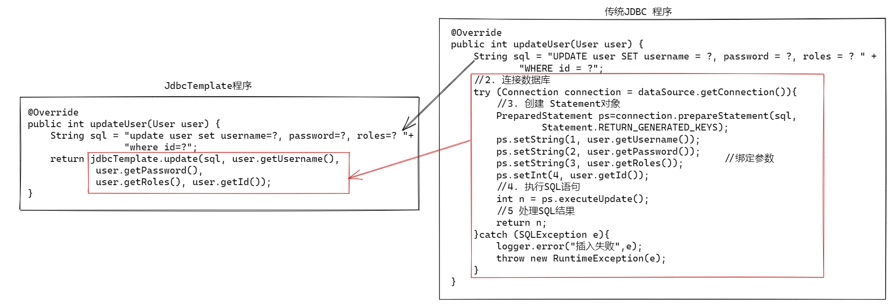
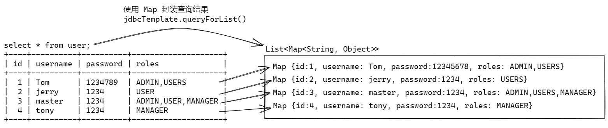
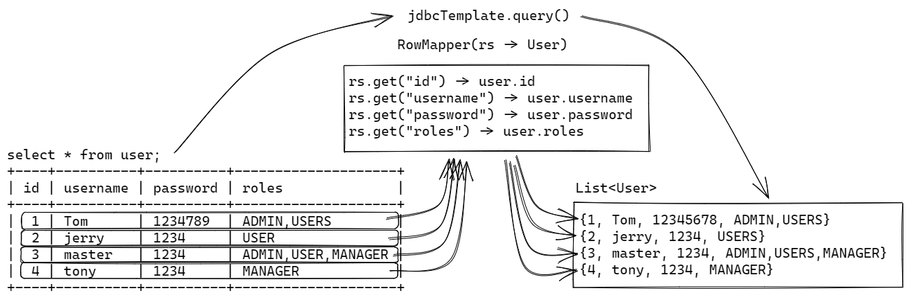
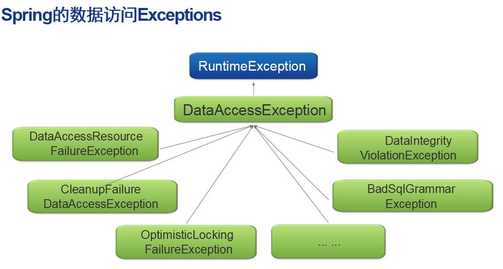
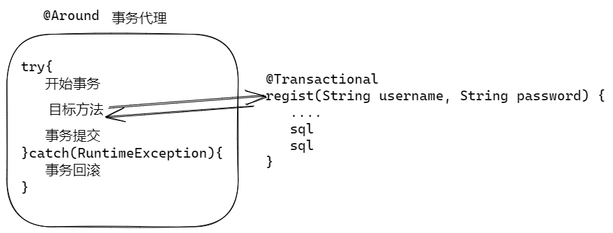
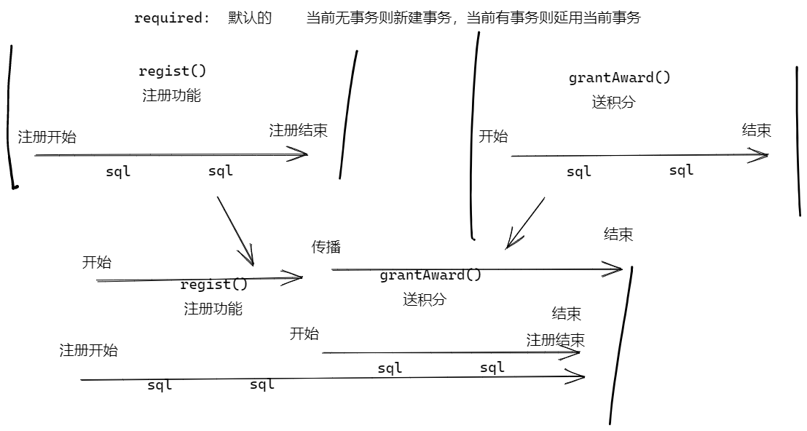

# Unit06 Spring JDBC 

## 使用传统 JDBC

使用步骤：6大步骤！

1. 注册数据库驱动
   1. 导入数据库驱动的依赖
   2. 新版数据库驱动可以自动注册，可以忽略这步
   3. Class.forName(驱动类名) 
2. 连接到数据库(创建数据库连接)
   1. 需要3个参数 url username password
3. 创建 Statement（语句）对象
4. 执行SQL语句（CRUD）
5. 处理SQL语句的结果
6. 关闭数据库连接
   1. Java 7 以后可以利用, try catch 的自动关闭功能，自动关闭连接

### 传统JDBC的不足：

- 代码中的冗余重复
- 代码繁琐易错
- 每次都要处理异常

## 什么是Spring JDBC 

Spring JDBC 也称为 Spring Data JDBC.

Spring JDBC 是对JDBC的轻量封装，解决了传统JDBC冗余，易错，以及异常处理的问题。

采用模板设计模式，将JDBC通用代码进行封装， 提供一个简洁使用方式：JdbcTemplate

## Spring JDBC什么时候用

Spring JDBC 是Spring提供的持久层解决方案， 轻量化封装，简化了JDBC的操作，又提供非常优秀的性能，适用于小的轻量级的项目

### 比较MyBatis 和 Spring JDBC：

- MyBatis  -- 大部分项目都用MyBatis
    - MyBatis是重量级的框架（相对于Spring JDBC），内部用到了反射和动态代理，执行效率没有Spring JDBC快
    - MyBatis封装更加彻底，几乎“零JDBC”编码，用起来非常方便
- Spring JDBC -- 适用于小的轻量级的项目  
    - 是轻量级的框架，实际上就是对传统JDBC的简单封装，提供了对异常的处理，执行效率和传统JDBC一样，非常轻快
    - Nacos底层使用了Spring JDBC
- MyBatis Plus 是在MyBatis基础上进行的简单扩展， 提供基本的CURD方法
    - 企业开发中，基本CRUD使用不多
    - 大部分都是复杂查询， 复杂查询不适合MyBatis Plus


## 使用Spring JDBC的步骤

1. 在Spring Boot 项目中导入相关依赖

```java
<!-- mysql驱动依赖 -->
<dependency>         
  <groupId>mysql</groupId>
  <artifactId>mysql-connector-java</artifactId>
</dependency>
<!-- spring-jdbc依赖 -->
<dependency>
  <groupId>org.springframework.boot</groupId>
  <artifactId>spring-boot-starter-jdbc</artifactId>
</dependency>
```

2. 在属性application.yml文件配置数据源信息

```java
spring:
  datasource:
    url: jdbc:mysql://localhost:3306/spring_test?characterEncoding=utf8&useSSL=false&serverTimezone=Asia/Shanghai&rewriteBatchedStatements=true
    username: root
    password: root
```

### Derby DB

https://db.apache.org/derby/docs/10.16/getstart/index.html


### 关于spring-boot-starter-jdbc自动配置

1. 添加依赖spring-boot-starter-jdbc后, 如果没有添加其他任何依赖，启动报错误 
2. 添加了内嵌数据库Derby后会自动创建HikariDataSource和JdbcTemplate
3. 如果依赖了spring-boot-starter-jdbc 和 JDBC 驱动，
   并且在application.yml设置的数据库连接参数，会自动创建创建HikariDataSource和JdbcTemplate
4. 如果配置了自定义的DataSource类型的Bean对象，则Spring Boot 就不再创建HikariDataSource对象，
   这样就实现了自定义DataSource配置

### 关于数据库连接池

Java 提供了数据库连接管理接口 javax.sql.DataSource

- 很多数据库驱动提供了DataSource接口的实现， 因为专用连接池，所以没有人使用！
- 使用第三方实现的DataSource对象，第三方是通用连接池， 可以连接任何数据库
  - Apache DBCP 连接池， Tomcat内嵌的连接池， 使用的人不多
  - C3P0 连接池， 曾经很火
  - HikariDataSource 是Spring JDBC 内嵌连接池， 据说性能最好
  - 阿里巴巴 Druid 连接池， 国内使用广泛， 可以提供SQL监控，方便调优。

注意： DataSource 是Java的接口，这个接口没有规定必须按照连接池方式实现， 厂商按照连接池方式实现了DataSource接口。


### JdbcTemplate的使用

导入spring-boot-starter-jdbc依赖、JDBC驱动依赖，并且配置了数据源后，
Spring Boot 会自动创建jdbcTemplate Bean，使用时候注入即可：

```java
@Autowired
JdbcTemplate jdbcTemplate;
```

测试从JdbcTemplate中获取连接对象，看是否获取成功，若能获取成功连接对象，则该模板类可以使用

```java
@Test
void dataSource() throws SQLException {
  System.out.println(jdbcTemplate.getDataSource().getConnection());
}
```

## 模板类 -- JdbcTemplate

JdbcTemplate 的优势：

- 大大简化了JDBC API的使用
  - 消除重复的模板代码
  - 减轻引起错误的常见原因
  - 正确处理**SQLExceptions**
- 在不牺牲性能的情况下
  - 提供对标准JDBC结构的完全访问

JdbcTemplate 封装的操作有哪些？

      1. 获取连接
      2. 执行SQL
      3. 参与事务
      4. 处理结果集
      5. 处理异常
      6. 释放连接

总之：程序员只需要调用该类中的方法即可完成相对应的操作，不用再写模板代码，不用考虑模板代码中的异常处理，操作方便了很多。

### 关于DAO

传统数据访问层： Data Access Object 数据访问对象，缩写为 dao， 在MyBatis 中称为 Mapper， 都是持久层对象的后缀名称。

Repository 仓库， 是Spring 提供的注解， 用于标注创建数据访问层对象。

也就是说， 在Spring创建数据访问层对象，就标注@Repository。 

### JdbcTemplate 使用

#### 增删改操作

```java
//                 更新SQL语句    更新的参数
jdbcTemplate.update(sql, Object...args)  
```



例子:

```java
@Override
public int updateUser(User user) {
    String sql = "update user set username=?, password=?, roles=? where id=?";
    return jdbcTemplate.update(sql, user.getUsername(), user.getPassword(),
        user.getRoles(), user.getId());
}
```

测试代码:

```java
@Test
void updateUser(){
    User user = new User();
    user.setId(1);
    user.setUsername("Tom");
    user.setPassword("1234789");
    user.setRoles("ADMIN,USERS");
    int n = userDao.updateUser(user);
    logger.debug("更新 {}", user);
    Assertions.assertEquals(1, n);
}
```

#### 返回自动生成的ID问题

如下代不能返回自动生成的ID:

```java
@Override
public int addUser(User user) {
    String sql = "insert into user (id,username,password,roles) values (null,?,?,?)";
    int num = jdbcTemplate.update(sql, user.getUsername(), user.getPassword(),
                                  user.getRoles());
    return num;
}
```

利用KeyHolder抓取自动生产的ID:

```java
@Override
public int addUser(User user) {
    String sql = "insert into user (id,username,password,roles) values (null,?,?,?)";
    //获取自动生成的 主键 值
    //用于抓取生产的ID的工具 keyHolder
    GeneratedKeyHolder keyHolder = new GeneratedKeyHolder();
    PreparedStatementCreator preparedStatementCreator = con -> {
        //创建 PreparedStatement, 务必添加 
        // Statement.RETURN_GENERATED_KEYS参数, 表示需要返回生成的ID
        PreparedStatement ps = con.prepareStatement(sql,
        PreparedStatement.RETURN_GENERATED_KEYS);
        //替换ps参数
        ps.setString(1, user.getUsername());
        ps.setString(2, user.getPassword());
        ps.setString(3, user.getRoles());
        //返回 ps 对象
        return ps;
    };
    int num = jdbcTemplate.update(preparedStatementCreator, keyHolder);
    //SQL 语句执行完成以后, 从keyHolder中抓取生产的自增ID
    user.setId(keyHolder.getKey().intValue());
    return num;
}
```

测试案例

```java
@Test
void addUser(){
    User user = new User();
    user.setUsername("Fan");
    user.setPassword("1234");
    user.setRoles("ADMIN");
    int n = userDao.addUser(user);
    Assertions.assertEquals(1, n);
    Assertions.assertNotNull(user.getId());
    logger.debug("{}", user);
}
```

#### 查询操作

查询简单类型 -- int  long   String   LocalDate。。。。。。

```
jdbcTemplate.queryForObject(sql,Class returnType, parameter...)
```

例子:

```java
@Override
public Integer countUsers() {
    String sql = "select count(*) from user";
    return jdbcTemplate.queryForObject(sql, Integer.class);
}
```

测试:

```java
@Test
void count(){
    Integer n = userDao.countUsers();
    logger.debug("users {}", n);
    Assertions.assertNotNull(n);
}
```

Generic Maps  -- 用Map封装查询结果, 了解即可，因为语义不清, 基本不用

查询的结果以键值对保存在map中，不会将数据封装入对象中，可读性差，了解即可。

```java
jdbcTemplate.queryForList(sql,Object...args) - List<Map<k,v>>
```



案例:

```java
/**
 * 使用 Map封装查询结果
 */
@Override
public List<Map<String, Object>> findAllUsers() {
    String sql = "select * from user";
    return jdbcTemplate.queryForList(sql);
}
```

测试:

```java
@Test
void userList(){
    List<Map<String, Object>> users = userDao.findAllUsers();
    users.forEach(user->{logger.debug("{}", user);});
}
```

Domain  Object -- （领域）对象封装查询结果, 就是使用Java Bean(VO)封装查询结果

JdbcTemplate不会自动将ResultSet中数据封映射到对象中，不会帮你完成自动映射，需要手动映射
通过实现接口RowMapper完成结果集到对象的映射



查询返回list集合, 集合中的元素是 领域对象 类型.

```java
jdbcTempalte.query(sql,RowMapper<T>) 
```

案例:

```java
private RowMapper<User> rowMapper = (rs, index)->{
    User user = new User();
    user.setId(rs.getInt("id"));
    user.setUsername(rs.getString("username"));
    user.setPassword(rs.getString("password"));
    user.setRoles(rs.getString("roles"));
    return user;
};

/**
 * jdbcTemplate查询,返回集合
 * @return
 */
@Override
public List<User> findAllUser() {
    String sql = "select * from user";
    return jdbcTemplate.query(sql, rowMapper);
}
```

测试:

```java
@Test
void testUsers(){
    List<User> users = userDao.findAllUser();
    users.forEach(user -> {logger.debug("{}", user);});
}
```

查询返回一个对象 -- queryForObject

```java
jdbcTemplate.queryForObject(sql,rowMapper, Object...args)
```

案例:

```java
@Override
public User findUserByName(String username) {
    String sql = "select * from user where username=?";
    return jdbcTemplate.queryForObject(sql, rowMapper, username);
}
```

测试:

```java
@Test
void findByName(){
    User user = userDao.findUserByName("Tom");
    logger.debug("{}", user);
    Assertions.assertEquals("Tom", user.getUsername()); 
}
```

queryForObject 方法只能返回一行数据, 多了 少了都会出现异常

- 没有查询结果返回, 则抛出 EmptyResultDataAccessException(空结果数据访问异常)
- 如果返回超过一个查询结果,则抛出IncorrectResultSizeDataAccessException(结果大小不正确)

如果有必要, 需要在DAO层进行异常处理:

```java
@Override
public User findUserByName(String username) {
    String sql = "select * from user where username=?";
    try {
        return jdbcTemplate.queryForObject(sql, rowMapper, username);
    }catch (EmptyResultDataAccessException e){
        return null;
    }
}
```

测试:

```java
@Test
void findByNameNull(){
    User user = userDao.findUserByName("Hook");
    logger.debug("{}", user);
    Assertions.assertNull(user);
}
```

### SQL 异常处理

- 复习异常分类：
  - 检查异常：在编译过程中能够检查到的异常，必须处理，否则编译不通过
  - 非检查异常/运行时异常：RuntimeException 在编译过程中检测不到，在运行过程中会出现的异常，叫做运行时异常
  
- Spring JDBC 将SQL异常封装为非检查异常:
  - RuntimeException <-- DataAccessException <-- Spring JDBC 异常
  - 方便统一处理异常: Spring JDBC代码中一般不用主动处理异常, 将异常自动向上抛出, 一般在控制器中统一处理.     




## 事务 Transactional

交易: 一手钱,一手货

定义(背下来): 事务是数据库中执行操作的最小执行单元，不可再分，要么全都执行成功，要么全都执行失败。

### 事务特性(背下来)

- A 原子性: 一组操作作为一个不可再分的单元
- C 一致性: 数据结果处理后, 总数不变, 前后一致
- I 隔离性: 事务之间彼此独立隔离, 互不影响
- D 持久性: 事务处理完成以后,数据永久保存, 持久存在

### 传统Java事务管理的问题

- 持久层框架不同，事务使用的API不同的
  - 不同框架使用不同的API方法编程处理事务, 代码不统一
- 当持久层框架确定后，手动管理事务，使用API方法开启事务，事务提交，事务回滚，代码重复
  - 手动编写事务处理代码, 繁琐, 刻板化
- 局部事务管理和分布式事务管理使用API不同
  - 局部事务是指一个服务器上的事务
  - 分布式事务是指多台服务器事务
  - 传统方式 API 也不同

### Spring声明式事务

- 提供了注解@Transactional，来进行事务管理, 添加上该注解，开启事务管理的机制
  - 无需编码, 自动处理, 简化了事务处理编程!
  - 不同底层事务, 使用相同的注解@Transactional
  - 分布式事务, 也采用统一的注解 @Transactional
- 在运行期，调用某个目标业务方法时，若检测到方法上有该注解，则开启事务管理，将切面中的通知代码织入到目标业务代码中，事务管理的通知是环绕通知。

### Spring事务管理优势

- 统一事务处理风格: 解决了持久层框架不同，使用API不同的问题--解决办法是通过平台事务管理器
- 使用AOP解决了代码重复问题，将事务管理的关注点代码提取到切面中，在运行期动态的进行织入
- 解决了全局事务和局部事务使用不同API的问题
    	通过事务管理器解决了以上问题
    	且全局事务和局部事务中，事务失败后，给出的处理方式是一样的

### 使用方法

1. 配置事务管理器: Spring Boot 中往往自动自动配置
   1. spring-boot-starter-jdbc 依赖中 就自动配置了JDBC事务管理器
   2. 如果单独使用Spring, 则需要手动配置 事务管理器(JavaBean)
      @EnableTransactionManagement
2. 使用 @Transactional注解 标注需要事务处理的方法

案例, 测试spring-boot-starter-jdbc自动配置的事务管理器:

```java
@SpringBootTest
public class TxTests {

    Logger logger = LoggerFactory.getLogger(TxTests.class);

    @Autowired
    PlatformTransactionManager transactionManager;

    @Test
    void tests(){
        logger.debug("{}", transactionManager);
    }
}
```

### @Transactional注解的用法

可以用于以下位置：

       1.  业务方法上方
       2.  业务层接口上方 -- 接口中的所有方法都开启事务管理 -- 从Spring5.0开始的
       3.  业务类上方 -- 类中所有的方法都开启事务管理

> 注意点：在Spring项目中（不是SpringBoot）,若要开启事务管理，必须在配置类的上方加注解**@EnableTransactionManagement**

测试事务注解, @Transactional 以后, 对象会被自动创建AOP 事务代理.

```java
@Override
@Transactional
public User regist(String username, String password) {
    if (username==null || password==null) {
        logger.warn("输入参数为空{}, {}", username, password);
        throw new IllegalParameterException("参数异常！");
    }
    logger.debug("输入参数{}, {}", username, password);
    User findUser = userDao.findUserByName(username);
    logger.debug("从数据库查到 {}", findUser);
    if (findUser!=null) {
        logger.warn("用户名 {} 已经被注册！", username);
        throw new UsernameExistsException("该用户名已经被注册！");
    }
    logger.debug("开始注册过程");
    User user = new User();
    user.setUsername(username);
    user.setPassword(password);
    int i = userDao.addUser(user);
    logger.debug("注册更新数量 {}", i);
    if (i!=1) {
        logger.warn("注册用户失败！");
        throw new RegistrationFailedException("注册用户失败！");
    }
    logger.debug("注册成功！{}", user);
    return user;
}

```

测试:

```java
@Autowired 
UserService userService;

@Test
void testUserService(){
    logger.debug("{}", userService.getClass());
}
```

### 声明式事务管理原理



- 采用的AOP，在运行期会生成代理对象
- 业务方法中抛出运行时异常，则事务回滚；若抛出的是检查异常，事务不会回滚

- @Transactional注解的属性
  - timeout:  指定超时时间，单位s  默认值-1，表示永不超时
    若同时在类上方和某个方法上方指定超时时间，则添加了该属性的方法的超时时间以方法上的时间为准，这里的现象是属性覆盖
    timeout超时是在执行SQL时候检查, 是否超时!

### 事务的回滚规则

1. 默认情况下，业务方法抛出运行时异常(RuntimeException)，事务回滚
2. 可以自定义回滚规则，通过属性rollbackFor和noRollBackFor来指定

### 事务传播

- 概念: 2个业务方法(至少有一个开启事务管理)之间存在调用现象，此时就会涉及到事务传播。

- 传播级别 -- 面试题, 属性：propagation
  - 属性值：7个
  - required:  默认的    当前无事务则新建事务，当前有事务则延用当前事务 
  - requires_new:   当前无事务，创建新事务；当前有事务，暂停当前事务，创建新事务
  - mandatory: 强制的  当前存在事务，使用当前事务，当前无事务，抛出异常
  - never：始终在无事务情况下执行，当前无事务，继续在无事务状态下执行，若当前有事务，抛出异常
  - not_supported:不使用事务，当前无事务，继续在无事务状态下执行，若当前有事务，则暂停当前事务，在无事务状态下执行
  - supports:支持，当前无事务，继续无事务 ；当前存在事务，使用当前事务
  - nested：嵌套的，当前无事务，创建新事务，当前存在事务，创建新的内嵌事务     
  大多数使用默认的: @Transactional(propagation = Propagation.REQUIRED)  
  
- 事务传播注意点：事务传播一定有代理对象调用, 类内部之间的方法没有事务传播

例子:  注册并且送 积分



修改注册业务:

```java
@Override
@Transactional
public User regist(String username, String password) {
    if (username==null || password==null) {
        logger.warn("输入参数为空{}, {}", username, password);
        throw new IllegalParameterException("参数异常！");
    }
    logger.debug("输入参数{}, {}", username, password);
    User findUser = userDao.findUserByName(username);
    logger.debug("从数据库查到 {}", findUser);
    if (findUser!=null) {
       logger.warn("用户名 {} 已经被注册！", username);
       throw new UsernameExistsException("该用户名已经被注册！");
    }
    logger.debug("开始注册过程");
    User user = new User();
    user.setUsername(username);
    user.setPassword(password);
    int i = userDao.addUser(user);
    logger.debug("注册更新数量 {}", i);
    if (i!=1) {
        logger.warn("注册用户失败！");
        throw new RegistrationFailedException("注册用户失败！");
    }
    logger.debug("注册成功！{}", user);
    //注册送积分
    awardService.grantAward(user, "注册", 100);
    return user;
}
```


测试: 如果没有异常, 则注册和送星都可以完成, 如果出现异常, 则送星和注册全部回退.

### 事务的隔离级别:

- isolation = Isolation.READ_UNCOMMITTED 读未提交, 不可以避免脏读, 幻读, 可重复读, 并发性好
- isolation = Isolation.READ_COMMITTED 读已提交, 建议使用, 不可以避免幻读, 可以避免重复读, 并发性能好
- isolation = Isolation.REPEATABLE_READ 可以重复读, 不可以避免幻读, 一定并发性能
- isolation = Isolation.SERIALIZABLE 序列化, 完全隔离, 不能并发, 性能不好

常用的是  READ_COMMITTED

### MySQL数据库事务隔离级别

ANSI SQL标准定义了4种事务隔离级别来避免3种数据不一致的问题。事务等级从高到低，分别为：

1. Serializable（序列化）
  系统中所有的事务以串行地方式逐个执行，所以能避免所有数据不一致情况。
  但是这种以排他方式来控制并发事务，串行化执行方式会导致事务排队，系统的并发量大幅下降，使用的时候要绝对慎重。
2. Repeatable read（可重复读）
  一个事务一旦开始，事务过程中所读取的所有数据不允许被其他事务修改。
  一个隔离级别没有办法解决“幻影读”的问题。
  因为它只“保护”了它读取的数据不被修改，但是其他数据会被修改。如果其他数据被修改后恰好满足了当前事务的过滤条件（where语句），
  那么就会发生“幻影读”的情况。
3. Read Committed（已提交读）
  一个事务能读取到其他事务提交过(Committed)的数据。
  一个事务在处理过程中如果重复读取某一个数据，而且这个数据恰好被其他事务修改并提交了，那么当前重复读取数据的事务就会出现同一个数据前后不同的情况。
  在这个隔离级别会发生“不可重复读”的场景。
4. Read Uncommitted（未提交读）
  一个事务能读取到其他事务修改过，但是还没有提交的(Uncommitted)的数据。
  数据被其他事务修改过，但还没有提交，就存在着回滚的可能性，这时候读取这些“未提交”数据的情况就是“脏读”。
  在这个隔离级别会发生“脏读”场景。

MySQL 默认是 Repeatable read（可重复读）

```sql
-- 查看当前事物级别：
SELECT @@tx_isolation; # MariaDB 10
select @@transaction_isolation; # MYSQL8
SELECT @@SESSION.transaction_isolation; # MYSQL8

-- 设置mysql的隔离级别：
set session transaction isolation level 需要设置的事务隔离级别

-- 设置read uncommitted级别：
set session transaction isolation level read uncommitted;

-- 设置read committed级别：
set session transaction isolation level read committed;

-- 设置repeatable read级别：
set session transaction isolation level repeatable read;

-- 设置serializable级别：
set session transaction isolation level serializable;
```
事务命令：
```sql
begin    -- 开始事务
rollback -- 回滚事务
commit   -- 提交事务
```


### @Transactional注解作用在集成测试

- 该注解可以作用在测试方法/类上方，但是执行之后会自动回滚，避免测试之后对数据进行清理。


