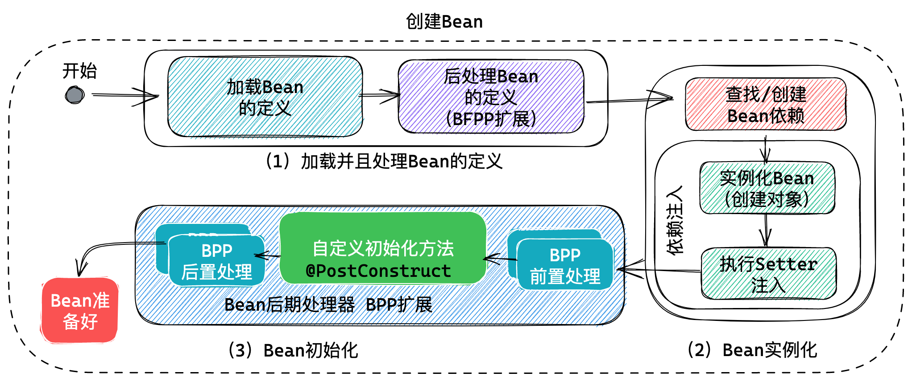
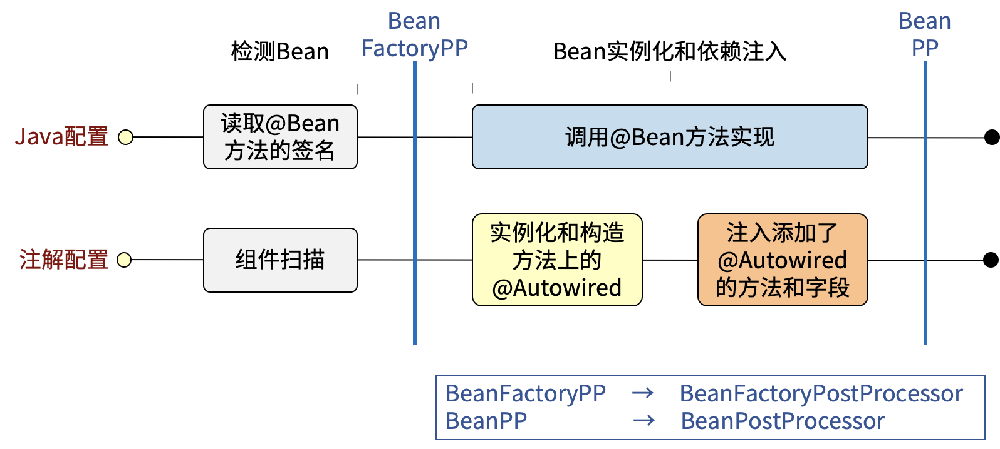
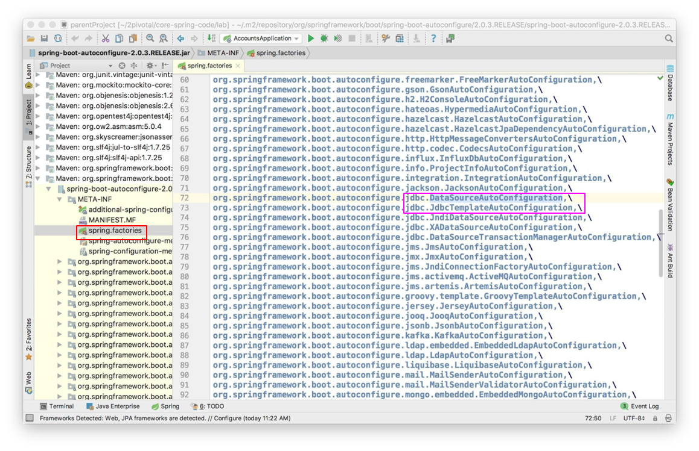
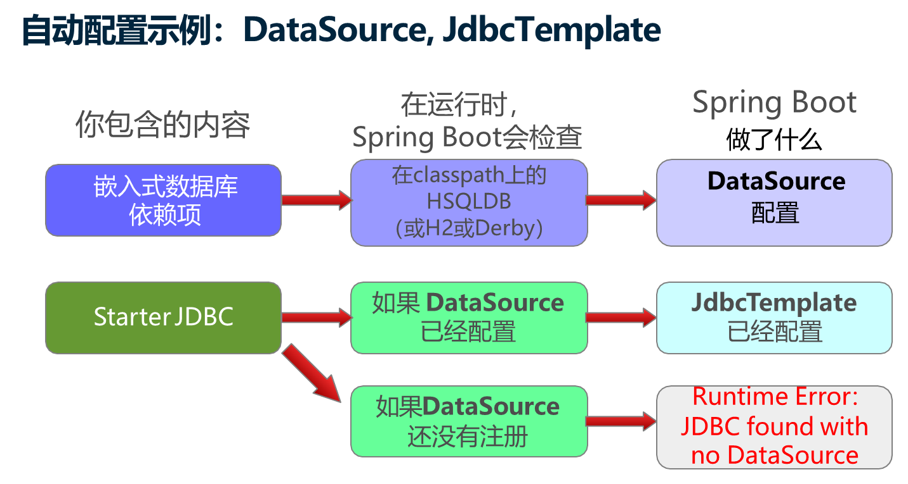

# Spring 生命周期 和 Spring Boot

## 今日内容：

1. Spring Bean 生命周期管理， 也就是Spring中Bean的创建、使用以及销毁的过程，经典面试题目！
2. Spring Boot 以及自动配置原理， 也是经典面试题目


## 生命周期管理 life-cycle

本次课程的目标就是研究Spring的完整Bean生命周期管理过程。


## 自定义的初始化和销毁功能

Spring 为了方便用户扩展功能，提供了在Bean生命周期管理过程中自动调用的声明周期管理方法功能：

- @PostConstruct 在对象实例化后，Bean初始化过程中调用用户自定义的方法
    - 标注在方法上，要求该方法无参且返回值为void
    - 可以用于初始化，如初始化缓存，初始化数据库连接
- @PreDestroy 在销毁Bean时候，执行用户自定义的方法
    - 标注在方法上，要求该方法无参且返回值为void
    - 清空缓存，释放资源
    - 关闭容器时候会自动调用
    - Spring会在JVM上挂“钩子”，关闭JVM时候，钩子会自动调用Spring容器的关闭方法
    - 这个方法不是绝对可靠，直接关闭进程时候不会执行
    - 只有单例对象，销毁时候才会执行销毁方法
- @Bean 注解使用属性设置销毁方法
    - @Bean(initMethod="populateCache", destroyMethod="flushCache")
- 可以根据实际业务需要执行这两个方法

关于 在Bean上标注了@Scope("prototype")

- 是“原型”范围，会创建多个实例， 每次使用bean时候都会创建一个新的Bean对象
  - getBean 和 注入Bean
- 如果不使用Bean，则不创建对象
- 创建对象时候会自动调用 @PostContruct 方法
- 多个实例时候因为对象太多，Spring将不再管理销毁方法， 也就关闭Spring时候不会调用 @PreDestroy方法
- 请自行销毁对象（设置引用为空），由GC销毁

## Bean的创建步骤

Bean的创建有3大步



1. 加载Bean的定义，加载Bean定义之后，并不会立即创建Bean对象！
    1. Spring 启动后，根据配置文件加载Bean的定义，包括处理@Bean 和 @Component 注解
    2. 找到Bean定义后，将转换应用于Bean定义，也就是可以进一步修改处理Bean定义
    3. 处理Bean定义时候调用了一系列实现 BeanFactoryPostProcessor 接口的对象。
    4. 可以自行扩展 BeanFactoryPostProcesser 接口，参与Bean后期处理功能。
    5. 其中包括处理 @PropertySource、@Value 的 PropertySourcesPlaceholderConfigurer
    6. 其中包括处理[`@Configuration`](https://docs.spring.io/spring-framework/docs/current/javadoc-api/org/springframework/context/annotation/Configuration.html) 的 ConfigurationClassPostProcessor
2. 实例化Bean对象，这一步才开始创建Bean对象
    1. 首先查找Bean的依赖关系，解决创建Bean的先后次序问题
    2. 实例化Bean对象，也就行创建Bean对象，这里包含构造器注入过程。
    3. 然后进行属性注入
3. Bean的初始化（这里是指对创建Bean以后的处理过程）
    1. Bean的初始化由一系列的BeanPostProcessor对象完成
    2. 先执行 BPP 的前置处理方法
    3. 然后执行Bean的自定义初始化方法
    4. 再执行BPP的后置处理方法
    5. 这个步骤可以干预扩展，可以自行实现BeanPostProcessor
    6. AOP代理就在在这一步添加的DefaultAdvisorAutoProxyCreator AspectJAwareAdvisorAutoProxyCreator
    7. Aspect j 的注解在AnnotationAwareAspectJAutoProxyCreator 处理 是一个BPP实现类！


### @Bean 和 @Component



# Spring Boot

## 独立使用Spring的问题

- 搭建一个Spring框架项目，创建maven项目，然后在项目中倒入spring框架用到的依赖 spring-core-xx spring-context-xx spring-aop-xx
     .........,

- 在Spring框架中导入依赖时是需要指定版本号的，此时就可能会产生版本不兼容问题。 eg:导入SpringMVC的依赖，导入mybatis的依赖，

- 框架之间的整合问题:SSM SpringMVC Spring Mybatis，必须导入整合的依赖

## 什么是Spring Boot

Spring Boot帮助你创建可以运行的独立的、基于Spring的生产级应用程序。

对Spring平台和第三方库采用Starter依赖，这样你就能以最少的代码开始工作。

大多数Spring Boot应用程序只需要很少的Spring配置。

你可以使用Spring Boot来创建Java应用程序，这些应用程序可以通过使用java -jar或更传统的war部署来启动。

我们还提供一个运行 "spring scripts "的命令行工具。

我们的主要目标是。

为所有的Spring开发提供一个从根本上更快、更广泛的入门体验。

**开箱即用**，但当需求开始偏离默认值时，迅速配置。

提供一系列大类项目常见的非功能特性（如嵌入式服务器、安全、度量、健康检查和外部化配置）。

## Spring Boot功能

Spring Boot 提供了四大功能。（还记得Spring提供的两大功能么？）

- **依赖管理**

- 自动配置

- 打包

- 热部署

面试题：Spring 和SpringBoot的区别：

- Spring（Spring Framework） 是Spring全家桶的基石，其核心功能是 IOC/DI、AOP
- Spring Boot 在Spring的基础上提供了开箱即用的功能，四大功能：依赖管理、自动配置、打包、热部署

### 依赖管理

搭建Spring环境，存在的问题:1. 导入的依赖项非常多 2. 版本不兼容问题

- **Spring** **Boot** 父级POM，内部使用 **dependencyManagement** 管理了常用组件， 解决版本兼容问题

    - start.spring.io 脚手架使用的是 parent 方式
    - start.aliyun.com 脚手架使用的是 dependencyManagement 方式

- 各种 starter 解决依赖包导入问题

    - spring-boot-starter 解决16个jar 

    - spring-boot-starter-test 解决测试相关的jar包

    - 举几个例子:

        –**spring-boot-starter-jdbc**

        –**spring-boot-starter-data-jpa**

        –**spring-boot-starter-web**

        –**spring-boot-starter-batch**

Spring Boot 依赖管理：1 Spring Boot 父级项目提供了依赖管理，2 Spring Boot项目通过XXX-starter自动依赖各种包。

### 自动配置

Enable: 允许

Auto： 自动 汽车

Configuration： 配置

SpringBoot 提供了自动配置功能

- 如果需要在Spring项目使用自动配置，需要在配置类上使用**@EnableAutoConfiguration**
- SpringBoot提供了强大的组合注解 @SpringBootApplication，它的元注解包括：
    - @EnableAutoConfiguration
    - @ComponentScan
    - @SpringBootConfiguration（继承于@Configuration）
- 在SpringBoot启动类中标注@SpringApplication 就开启了自动配置功能

@EnableAutoConfiguration是如何工作的：

- @EnableAutoConfiguration会读取工厂配置
    - 从jar文件中读取spring-boot-autoconfigure/META-INF/spring.factories
    - 找到 标注@Configuration 的**自动配置类**
    - 按照自动配置类中的注解完成自动配置

**自动配置类**实例



**什么是自动配置类**

预先写好的配置类 

```java
@Configuration(proxyBeanMethods = false)
@ConditionalOnClass({ DataSource.class, EmbeddedDatabaseType.class })
@ConditionalOnMissingBean(type = "io.r2dbc.spi.ConnectionFactory")
@EnableConfigurationProperties(DataSourceProperties.class)
@Import({ DataSourcePoolMetadataProvidersConfiguration.class, DataSourceInitializationConfiguration.class })
public class DataSourceAutoConfiguration {

   @Configuration(proxyBeanMethods = false)
   @Conditional(EmbeddedDatabaseCondition.class)
   @ConditionalOnMissingBean({ DataSource.class, XADataSource.class })
   @Import(EmbeddedDataSourceConfiguration.class)
   protected static class EmbeddedDatabaseConfiguration {

   }
```

Conditional： 条件

Missing: 缺少

**@Conditional**注解， 是系列注解 @ConditionalXXX 

- 允许条件性的创建Bean
  - 仅当其它Bean存在（或不存在）时创建 Bean 对象

@ConditionalOnBean(Worker.class) 在存在了Worker类型的Bean的时候，创建当前的Bean对象

@ConditionalOnMissingBean(Tool.class)  在缺少Tool类型的 Bean时候， 创建当前的Bean

例子： 存在 Worker.class 就创建对象 Saw

```java
@Component
@ConditionalOnBean(Worker.class)
public class Saw implements Tool {
    @Override
    public String toString() {
        return "寒冰锯";
    }
}
```

例子： 不存在Tool类型的Bean就创建Axe， 使用类型比Bean Name更加方便

```java
@Component
@ConditionalOnMissingBean(value = Tool.class, ignored = Axe.class)
public class Axe implements Tool {
    @Override
    public String toString() {
        return "开天斧";
    }
}
```

自动配置数据库链接的例子：

添加 Spring boot jdbc 和 Derby 就会自动配置：



SpringBoot中自定义Bean配置和自动配置的顺序：

- 在定义的Bean显式的创建之后处理自动配置类，你定义的Bean总是优先于自动配置
- 问题：若自己在配置文件中已经配置了数据源，则SpringBoot是否还自动配置数据源

**因为优先处理 用户自定义配置， 再处理自动配置，可以使用自定义配置覆盖自动配置！！**

**覆盖配置** 也就是修改自动配置

- Spring Boot的设计是为了让覆盖更简单

- 有几种选项

  1. 设置一些Spring Boot的属性（application.properties）

  2. 自己显式的定义Bean，则Spring Boot不会再创建自己的Bean对象

  3. 显式禁用一些自动配置

  4. 更换依赖项

1 **设置SpringBoot**的一些属性

- 例如： 外置数据源配置属性，可以覆盖SpringBoot默认数据源配置，比如自动更换为MySQL数据库

2 自己显式的定义Bean， 创建自己的数据源对象，Spring Boot 就不会自己创建数据源对象了

3 显式禁用一些自动配置

- @EnableAutoConfiguration(exclude=DataSourceAutoConfiguration.**class**)

- spring.autoconfigure.exclude=\

     org.springframework.boot.autoconfigure.jdbc.DataSourceAutoConfiguration

4 **显式替代依赖项**

```xml
<dependency>
    <groupId>org.springframework.boot</groupId>
    <artifactId>spring-boot-starter-web</artifactId>
    <exclusions>
        <exclusion>
            <groupId>org.springframework.boot</groupId>
            <artifactId>spring-boot-starter-tomcat</artifactId>
        </exclusion>
    </exclusions>
</dependency>
<dependency>
    <groupId>org.springframework.boot</groupId>
    <artifactId>spring-boot-starter-jetty</artifactId>
</dependency>
```

### 打包

Fat： 肥 、 胖

Fat jar： 胖jar

Spring Boot 提供了Fat jar 打包方式:

- 将全部的依赖项和配置、Java类等都打包到一个jar文件，包含内嵌Web服务器。

- 只需要一个命令就能部署启动： 关闭时候使用 Ctrl+C

  ```sh
  java -jar xxxx.jar
  ```

- 文件扩展名， 可以是jar或者war都可以

- 同时也提供传统部署jar（瘦jar）没有包含依赖项，可以部署到Tomcat中

```sh
java -jar spring-boot-0.0.1-SNAPSHOT.jar
```

### 热部署（了解）

开发过程中需要多次调试，经常重启服务器， SpringBoot提供了开发工具， 可以实现热部署，不关闭服务器， 自动部署Java类等资源。

添加一个依赖就可以了。

```xml
<!-- Spring Boot 开发工具， 可以实现热部署功能 -->
<dependency>
    <groupId>org.springframework.boot</groupId>
    <artifactId>spring-boot-devtools</artifactId>
</dependency>
```

更容易开发Spring Boot项目

- 自动重启：当一个类改变时（重新编译）

- 支持从IDE远程执行应用程序、全局开发工具设置的附加功能

注意：IDEA中 Spring 热部署工具， 经常失效！


