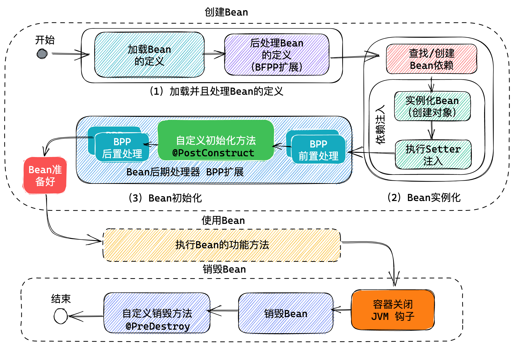
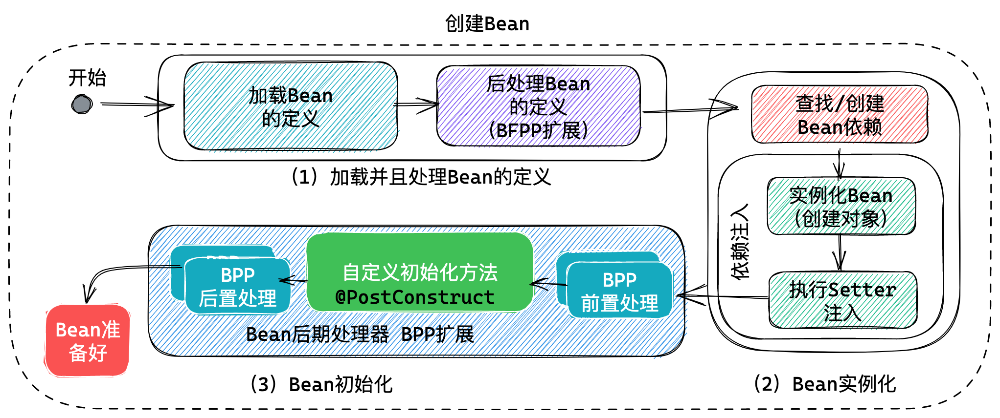
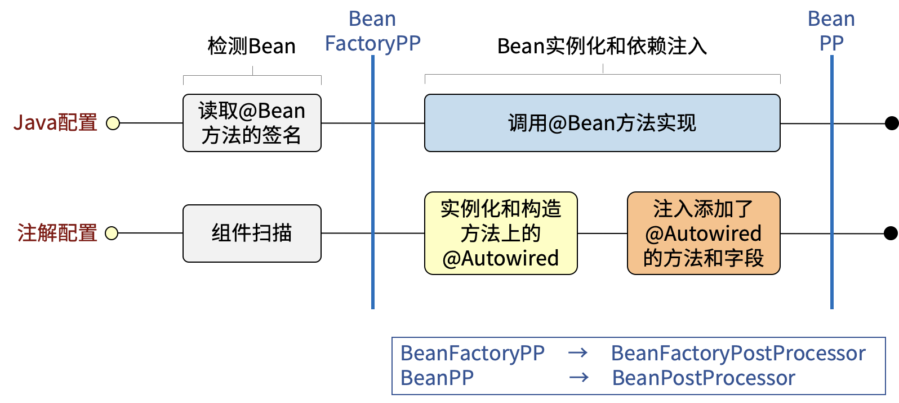
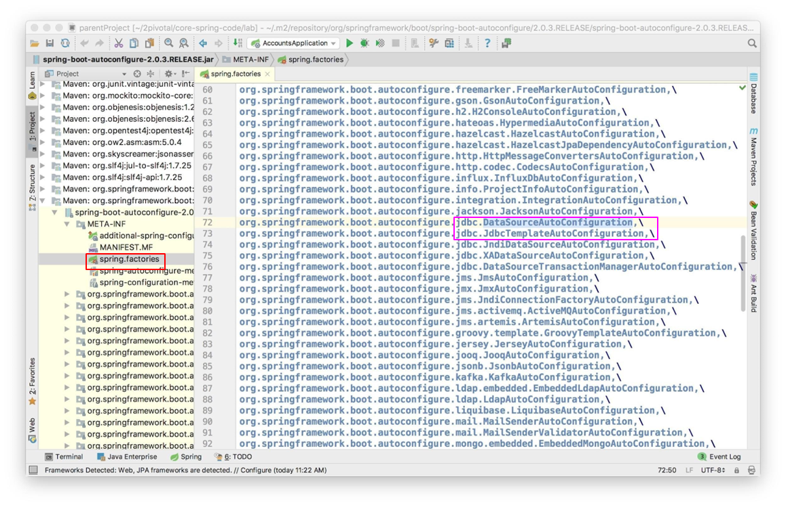
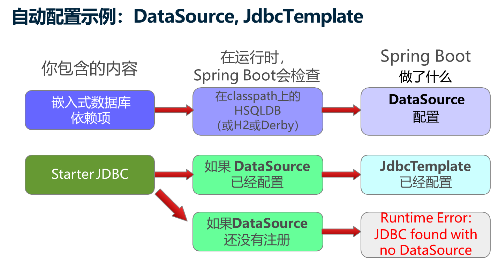

# Spring 生命周期 和 Spring Boot

## 今日内容：

1. Spring Bean 生命周期管理， 也就是Spring中Bean的创建、使用以及销毁的过程，经典面试题目！
2. Spring Boot 以及自动配置原理， 也是经典面试题目


## 生命周期管理 life-cycle

本次课程的目标就是研究Spring的完整Bean生命周期管理过程。



## 自定义的初始化和销毁方法

Spring 为了方便用户扩展功能，提供了在Bean生命周期管理过程中自动调用的声明周期管理方法功能：

- @PostConstruct 在对象实例化后，Bean初始化过程中调用用户自定义的方法
    - 标注在方法上，要求该方法无参且返回值为void
    - 可以用于初始化，如初始化缓存，初始化数据库连接
- @PreDestroy 在销毁Bean时候，执行用户自定义的方法
    - 标注在方法上，要求该方法无参且返回值为void
    - 清空缓存，释放资源
    - 关闭容器时候会自动调用
    - Spring会在JVM上挂“钩子”，关闭JVM时候，钩子会自动调用Spring容器的关闭方法
    - 这个方法不是绝对可靠，直接关闭进程时候不会执行
    - 只有单例对象，销毁时候才会执行销毁方法
    

案例：
```java
/**
 * 标签服务
 * concurrent 并发
 */
@Component
public class TagService {
    Logger logger = LoggerFactory.getLogger(TagService.class);
    /**
     * 本地缓存，缓存了标签信息
     */
    private final CopyOnWriteArrayList<String> tags = new CopyOnWriteArrayList<>();

    @PostConstruct  //创建对象以后调用
    public void initTags() {
        tags.add("应季");
        tags.add("爆款");
        tags.add("进口");
        tags.add("生鲜");
        tags.add("健身");
        logger.debug("初始化标签{}", tags);
    }

    public List<String> getTags() {
        return tags;
    }

    @PreDestroy //销毁对象之前调用
    public void destroy() {
        logger.debug("清空标签{}", tags);
        tags.clear();
    }
}
```

测试案例：

```java
@SpringBootTest
public class TagServiceTests {

    Logger logger = LoggerFactory.getLogger(TagServiceTests.class);

    @Autowired
    TagService tagService;

    @Test
    void tests(){
        List<String> tags = tagService.getTags();
        tags.forEach(tag->logger.debug("{}", tag));
    }
}
```


@Bean Bean的生命周期管理方法

- @Bean 注解使用属性设置销毁方法
    - @Bean(initMethod="populateCache", destroyMethod="flushCache")
- 可以根据实际业务需要执行这两个方法

案例：Bean 组件
```java
public class CategoryService {
    Logger logger = LoggerFactory.getLogger(CategoryService.class);
    /**
     * 分类缓存
     */
    private CopyOnWriteArrayList<Category> categoryList;

    public void init() {
        categoryList = new CopyOnWriteArrayList<>();
        categoryList.add(new Category("1","家电"));
        categoryList.add(new Category("2","食品"));
        categoryList.add(new Category("2","服装"));
        logger.debug("初始化分类{}", categoryList);
    }

    public List<Category> getCategoryList() {
        return categoryList;
    }

    public void destroy(){
        logger.debug("销毁 {}", categoryList);
        categoryList.clear();
    }
}
```

配置类：
```java
@Configuration
public class ServiceConfig {

    /**
     * @Bean 的属性调用生命周期管理方法
     * initMethod 初始化方法 等同与 @PostConstruct
     * destroyMethod 销毁方法 等同与 @PreDestroy
     * initMethod=“初始化方法名”
     * destroyMethod=“销毁方法名”
     */
    @Bean(initMethod = "init", destroyMethod = "destroy")
    public CategoryService categoryService() {
        return new CategoryService();
    }
}
```

Java 虚拟机提供了“系统钩子”，正常关闭系统时候可以自动执行钩子线程：
```java
public class SystemHookDemo {
    public static void main(String[] args) {
        /*
         * Runtime 运行时， 代表正在运行的Java虚拟机！
         * runtime 可以获取当前虚拟机全部的信息
         * runtime 允许挂“钩子”，钩子是一个线程，
         * 在JVM关闭时候， 会自动执行这个线程
         */
        Runtime runtime = Runtime.getRuntime();
        long bytes = runtime.totalMemory();
        System.out.println("当前内存数："+bytes);
        //为虚拟机挂上关闭时候的钩子
        runtime.addShutdownHook(new DemoHook());
        System.out.println("关闭系统");
    }
}

class DemoHook extends Thread{
    @Override
    public void run() {
        System.out.println("JVM正在关闭");
    }
}
```

Spring 会在Java虚拟机上挂上钩子，感知虚拟机的关闭，原理如下：
```java
/**
 * 在Spring 中为系统挂上一个自己的系统关闭钩子
 */
@Component
public class HookBean extends Thread {

    static final Logger logger = LoggerFactory.getLogger(HookBean.class);

    @PostConstruct
    public void init() {
        logger.debug("为JVM挂钩子");
        Runtime.getRuntime().addShutdownHook(this);
    }

    @Override
    public void run() {
        logger.debug("系统正在关闭");
    }
}
```


关于 在Bean上标注了@Scope("prototype")

- 是“原型”范围，会创建多个实例， 每次使用bean时候都会创建一个新的Bean对象
  - getBean 和 注入Bean
- 如果不使用Bean，则不创建对象
- 创建对象时候会自动调用 @PostContruct 方法
- 多个实例时候因为对象太多，Spring将不再管理销毁方法， 也就关闭Spring时候不会调用 @PreDestroy方法
- 请自行销毁对象（设置引用为空），由GC销毁

案例：
```java
@Component
@Scope("prototype")
public class NameService {
    Logger logger = LoggerFactory.getLogger(NameService.class);
    /**
     * 本地缓存，缓存了名字信息
     */
    private CopyOnWriteArrayList<String> names = new CopyOnWriteArrayList<>();

    @PostConstruct
    public void init(){
        names.add("Tom");
        names.add("Jerry");
        names.add("Andy");
        logger.debug("初始化 {}", names);
    }

    /**
     * Spring不会调用“Prototype”组件的销毁方法
     */
    @PreDestroy 
    public void destroy(){
        logger.debug("销毁 {}", names);
        names.clear();
    }
}

```

## Bean的创建步骤

Bean的创建有3大步



1. 加载Bean的定义，加载Bean定义之后，并不会立即创建Bean对象！
    1. Spring 启动后，根据配置文件加载Bean的定义，包括处理@Bean 和 @Component 注解
    2. 找到Bean定义后，将转换应用于Bean定义，也就是可以进一步修改处理Bean定义
    3. 处理Bean定义时候调用了一系列实现 BeanFactoryPostProcessor 接口的对象。
    4. 可以自行扩展 BeanFactoryPostProcesser 接口，参与Bean后期处理功能。
    5. 其中包括处理 @PropertySource、@Value 的 PropertySourcesPlaceholderConfigurer
       - 参考：https://docs.spring.io/spring-framework/docs/current/javadoc-api/org/springframework/context/support/PropertySourcesPlaceholderConfigurer.html
    6. 其中包括处理 @Configuration 的 ConfigurationClassPostProcessor 
       - 参考：https://docs.spring.io/spring-framework/docs/current/javadoc-api/org/springframework/context/annotation/ConfigurationClassPostProcessor.html
2. 实例化Bean对象，这一步才开始创建Bean对象
    1. 首先查找Bean的依赖关系，解决创建Bean的先后次序问题
    2. 实例化Bean对象，也就行创建Bean对象，这里包含构造器注入过程。
    3. 然后进行属性注入
3. Bean的初始化（这里是指对创建Bean以后的处理过程）
    1. Bean的初始化由一系列的BeanPostProcessor对象完成
    2. 先执行 BPP 的前置处理方法
    3. 然后执行Bean的自定义初始化方法
    4. 再执行BPP的后置处理方法
    5. 这个步骤可以干预扩展，可以自行实现BeanPostProcessor
    6. AOP代理就在在这一步添加的DefaultAdvisorAutoProxyCreator AspectJAwareAdvisorAutoProxyCreator
    7. AspectJ 的注解在AnnotationAwareAspectJAutoProxyCreator 处理 是一个BPP实现类！
        - 参考： https://docs.spring.io/spring-framework/docs/current/javadoc-api/org/springframework/aop/framework/autoproxy/AbstractAdvisorAutoProxyCreator.html

BeanFactoryPostProcesser 案例：
```java
/**
 * BeanFactoryPostProcessor Bean工厂后期处理器，
 * 其中使用一个方法 postProcessBeanFactory Bean工厂后置处理
 * 在加载了Bean定义信息以后，对Bean定义进行后续转换处理。
 * 原则上不建议自行处理
 * configurableListableBeanFactory 对象中封装了全部的 Bean定义信息
 */
@Component
public class MyBeanFactoryPostProcessor implements BeanFactoryPostProcessor  {
    Logger logger = LoggerFactory.getLogger(MyBeanFactoryPostProcessor.class);

    /**
     * postProcessBeanFactory 在Spring加载全部Bean定义以后执行
     * @param configurableListableBeanFactory 这个对象封装了全部Bean定义信息
     * @throws BeansException bean定义加载失败抛出异常，如果抛出异常， 则Spring初始化失败！
     */
    @Override
    public void postProcessBeanFactory(
            ConfigurableListableBeanFactory configurableListableBeanFactory)
            throws BeansException {
        //获取全部的Bean定义， getBeanDefinitionNames获取Bean定义的名称
        String[] beanNames = configurableListableBeanFactory.getBeanDefinitionNames();
        for (String name : beanNames) {
            logger.debug("bean name: {}", name);
        }
    }
}
```

BeanPostProcessor 案例：
```java
/**
 * Post 后期
 * Process 处理
 * Processor 处理器
 * Before 之前
 * After 之后
 * Initialization：初始化， 这里是指Bean的初始化过程
 * BeanPostProcessor Bean后期处理器， 在创建了Bean对象之后对象Bean进行处理
 * 其中包括两个方法
 *  postProcessBeforeInitialization：bean后期处理，在初始化之前执行
 *  postProcessAfterInitialization：bean后期处理，在初始化之后执行
 */
@Component
public class MyBeanPostProcessor implements BeanPostProcessor {
    Logger logger = LoggerFactory.getLogger(MyBeanPostProcessor.class);
    @Override
    public Object postProcessBeforeInitialization(Object bean, String beanName)
            throws BeansException {
        logger.debug("在Bean初始化之前执行 {} {}", bean, beanName);
        //bean 是创建完成的Bean对象
        return bean; // 务必 返回创建的 Bean对象
    }

    @Override
    public Object postProcessAfterInitialization(Object bean, String beanName)
            throws BeansException {
        logger.debug("在Bean初始化之后执行 {} {}", bean, beanName);
        //bean 是创建完成的Bean对象
        return bean; // 务必 返回创建的 Bean对象
    }
}
```

添加AOP切面后会自动创建代理：
```java
@Component
@Aspect
public class DemoAspect {
    Logger logger = LoggerFactory.getLogger(DemoAspect.class);

    @Before("bean(categoryService)")
    public void test(){
        logger.debug("在方法之前执行");
    }
}
```


### @Bean 和 @Component

@Bean 和 @Component 注解处理方式都是一样的：



# Spring Boot 
案例在 spring-boot 模块

## 独立使用Spring的问题

- 搭建一个Spring框架项目，创建maven项目，然后在项目中倒入spring框架用到的依赖 
  - spring-core-xx
  - spring-context-xx
  - spring-aop-xx 
  -  ........
- 在Spring框架中导入依赖时是需要指定版本号的，此时就可能会产生版本不兼容问题。 eg:导入SpringMVC的依赖，导入mybatis的依赖，
- 框架之间的整合问题:SSM SpringMVC Spring Mybatis，必须导入整合的依赖

## 什么是Spring Boot

Spring Boot 好处：

- Spring Boot帮助你创建可以运行的独立的、基于Spring的生产级应用程序。
- 对Spring平台和第三方库采用Starter依赖，这样你就能以最少的代码开始工作。
- 大多数Spring Boot应用程序只需要很少的Spring配置。
- 你可以使用Spring Boot来创建Java应用程序，这些应用程序可以通过使用java -jar或更传统的war部署来启动。
- 我们还提供一个运行 "spring scripts "的命令行工具。

Spring Boot的主要目标是。
- 为所有的Spring开发提供一个从根本上更快、更广泛的入门体验。
- **开箱即用**，但当需求开始偏离默认值时，迅速配置。
- 提供一系列大类项目常见的非功能特性（如嵌入式服务器、安全、度量、健康检查和外部化配置）。

## Spring Boot功能

Spring Boot 提供了四大功能。（还记得Spring提供的两大功能么？）
- 依赖管理
- 自动配置
- 打包
- 热部署

面试题：Spring 和SpringBoot的区别：

- Spring（Spring Framework） 是Spring全家桶的基石，其核心功能是 IOC/DI、AOP
- Spring Boot 在Spring的基础上提供了开箱即用的功能，四大功能：依赖管理、自动配置、打包、热部署

### 依赖管理

搭建Spring环境，存在的问题:1. 导入的依赖项非常多 2. 版本不兼容问题

- **Spring Boot** 父级POM，内部使用 **dependencyManagement** 管理了常用组件， 解决版本兼容问题
    - start.spring.io 脚手架使用的是 parent 方式
    - start.aliyun.com 脚手架使用的是 dependencyManagement 方式

- 各种 starter 解决依赖包导入问题
    - spring-boot-starter 解决16个jar
    - spring-boot-starter-test 解决测试相关的jar包
    - 举几个例子:
        – spring-boot-starter-jdbc
        – spring-boot-starter-data-jpa
        – spring-boot-starter-web
        – spring-boot-starter-batch

Spring Boot 依赖管理：1 Spring Boot 父级项目提供了依赖管理，2 Spring Boot项目通过XXX-starter自动依赖各种包。

```xml
<dependencies>
    <dependency>
        <groupId>org.springframework.boot</groupId>
        <artifactId>spring-boot-starter-jdbc</artifactId>
    </dependency>
    <dependency>
        <groupId>org.springframework.boot</groupId>
        <artifactId>spring-boot-starter-web</artifactId>
    </dependency>
</dependencies>
```

### 自动配置

Enable: 允许

Auto： 自动 汽车

Configuration： 配置

SpringBoot 提供了自动配置功能

- 如果需要在Spring项目使用自动配置，需要在配置类上使用**@EnableAutoConfiguration**
- SpringBoot提供了强大的组合注解 @SpringBootApplication，它的元注解包括：
    - @EnableAutoConfiguration
    - @ComponentScan
    - @SpringBootConfiguration（继承于@Configuration）
- 在SpringBoot启动类中标注@SpringApplication 就开启了自动配置功能

@SpringBootApplication 的元注解包括 @EnableAutoConfiguration
```java
@Target({ElementType.TYPE})
@Retention(RetentionPolicy.RUNTIME)
@Documented
@Inherited
@SpringBootConfiguration
@EnableAutoConfiguration
@ComponentScan(
    excludeFilters = {@Filter(
    type = FilterType.CUSTOM,
    classes = {TypeExcludeFilter.class}
), @Filter(
    type = FilterType.CUSTOM,
    classes = {AutoConfigurationExcludeFilter.class}
)}
)
public @interface SpringBootApplication {
}
```

@EnableAutoConfiguration是如何工作的：

- @EnableAutoConfiguration会读取工厂配置
    - 从jar文件中读取spring-boot-autoconfigure/META-INF/spring.factories
    - 找到 标注@Configuration 的**自动配置类**
    - 按照自动配置类中的注解完成自动配置
    

**自动配置类**实例



**什么是自动配置类**

预先写好的配置类 

```java
@Configuration(proxyBeanMethods = false)
@ConditionalOnClass({ DataSource.class, EmbeddedDatabaseType.class })
@ConditionalOnMissingBean(type = "io.r2dbc.spi.ConnectionFactory")
@EnableConfigurationProperties(DataSourceProperties.class)
@Import({ DataSourcePoolMetadataProvidersConfiguration.class, DataSourceInitializationConfiguration.class })
public class DataSourceAutoConfiguration {

   @Configuration(proxyBeanMethods = false)
   @Conditional(EmbeddedDatabaseCondition.class)
   @ConditionalOnMissingBean({ DataSource.class, XADataSource.class })
   @Import(EmbeddedDataSourceConfiguration.class)
   protected static class EmbeddedDatabaseConfiguration {

   }
```

Conditional： 条件
Missing: 缺少

**@Conditional**注解， 是系列注解 @ConditionalXXX
- 允许条件性的创建Bean
  - 仅当其它Bean存在（或不存在）时创建 Bean 对象

@ConditionalOnBean(Worker.class) 在存在了Worker类型的Bean的时候，创建当前的Bean对象

@ConditionalOnMissingBean(Tool.class)  在缺少Tool类型的 Bean时候， 创建当前的Bean

例子： 存在 Worker.class 就创建对象 Saw

```java
@Component
@ConditionalOnBean(Worker.class)
public class Saw implements Tool {
    @Override
    public String toString() {
        return "寒冰锯";
    }
}
```

例子： 不存在Tool类型的Bean就创建Axe， 使用类型比Bean Name更加方便

```java
@Component
@ConditionalOnMissingBean(value = Tool.class, ignored = Axe.class)
public class Axe implements Tool {
    @Override
    public String toString() {
        return "开天斧";
    }
}
```

自动配置数据库链接的例子：

添加 Spring boot jdbc 和 Derby 就会自动配置：



案例, Spring Boot项目添加Derby和Spring Jdbc依赖就会自动配置数据源和JdbcTemplate：
```xml
<dependencies>
    <dependency>
        <groupId>org.apache.derby</groupId>
        <artifactId>derby</artifactId>
    </dependency>
    <dependency>
        <groupId>org.springframework.boot</groupId>
        <artifactId>spring-boot-starter-jdbc</artifactId>
    </dependency>
</dependencies>
```

测试：
```java
@SpringBootTest
public class DataSourceTests {
    Logger logger = LoggerFactory.getLogger(DataSourceTests.class);

    @Test
    void test(){
        logger.debug("测试");
    }

    @Autowired
    JdbcTemplate jdbcTemplate;

    @Test
    void testJdbcTemplate(){
        logger.debug("{}", jdbcTemplate);
    }

    @Autowired
    DataSource dataSource;
    @Test
    void driver() throws SQLException {
        logger.debug("{}", dataSource.getConnection()
                        .getMetaData().getDriverName());
    }

    @Test
    void testDataSource(){
        logger.debug("{}", dataSource.getClass().getName());
    }
}
```

添加MySQL驱动和配置后，就自动更换了数据源连接池：
```xml
<dependency>
    <groupId>mysql</groupId>
    <artifactId>mysql-connector-java</artifactId>
    <scope>runtime</scope>
</dependency>
```
```properties
# 配置MySQL驱动， 就会自动替换Derby数据库配置
spring.datasource.url=jdbc:mysql://localhost:3306/mysql?characterEncoding=utf8&useSSL=false&serverTimezone=Asia/Shanghai&rewriteBatchedStatements=true
spring.datasource.username=root
spring.datasource.password=root
```

手动配置了数据源，就会自动替换默认数据源：
```xml
<dependency>
    <groupId>com.alibaba</groupId>
    <artifactId>druid</artifactId>
    <version>1.2.12</version>
</dependency>
```
```java
@Configuration
public class DataSourceConfig {
    //获取 application.properties 中的配置信息
    @Value("${spring.datasource.url}")
    String url;
    @Value("${spring.datasource.username}")
    String username;
    @Value("${spring.datasource.password}")
    String password;

    @Bean
    public DataSource dataSource(){
        DruidDataSource dataSource = new DruidDataSource();
        dataSource.setUrl(url);
        dataSource.setUsername(username);
        dataSource.setPassword(password);
        return dataSource;
    }
}
```

SpringBoot中自定义Bean配置和自动配置的顺序：

- 在定义的Bean显式的创建之后处理自动配置类，你定义的Bean总是优先于自动配置
- 问题：若自己在配置文件中已经配置了数据源，则SpringBoot是否还自动配置数据源

**因为优先处理 用户自定义配置， 再处理自动配置，可以使用自定义配置覆盖自动配置！！**

**覆盖配置** 也就是修改自动配置

- Spring Boot的设计是为了让覆盖更简单

- 有几种选项
  1. 设置一些Spring Boot的属性（application.properties）
  2. 自己显式的定义Bean，则Spring Boot不会再创建自己的Bean对象
  3. 显式禁用一些自动配置
  4. 更换依赖项

1 **设置SpringBoot**的一些属性
  - 例如： 外置数据源配置属性，可以覆盖SpringBoot默认数据源配置，比如自动更换为MySQL数据库

2 自己显式的定义Bean， 创建自己的数据源对象，Spring Boot 就不会自己创建数据源对象了

3 显式禁用一些自动配置

- @EnableAutoConfiguration(exclude=DataSourceAutoConfiguration.**class**)
- spring.autoconfigure.exclude=\
   org.springframework.boot.autoconfigure.jdbc.DataSourceAutoConfiguration

4 **显式替代依赖项**

```xml
<dependency>
    <groupId>org.springframework.boot</groupId>
    <artifactId>spring-boot-starter-web</artifactId>
    <exclusions>
        <exclusion>
            <groupId>org.springframework.boot</groupId>
            <artifactId>spring-boot-starter-tomcat</artifactId>
        </exclusion>
    </exclusions>
</dependency>
<dependency>
    <groupId>org.springframework.boot</groupId>
    <artifactId>spring-boot-starter-jetty</artifactId>
</dependency>
```

### 打包

Fat： 肥 、 胖

Fat jar： 胖jar

Spring Boot 提供了Fat jar 打包方式:

- 将全部的依赖项和配置、Java类等都打包到一个jar文件，包含内嵌Web服务器。
- 只需要一个命令就能部署启动： 关闭时候使用 Ctrl+C
  ```sh
  java -jar xxxx.jar
  ```
- 文件扩展名， 可以是jar或者war都可以
- 同时也提供传统部署jar（瘦jar）没有包含依赖项，可以部署到Tomcat中

```sh
java -jar spring-boot-0.0.1-SNAPSHOT.jar
```

### 热部署（了解）

开发过程中需要多次调试，经常重启服务器， SpringBoot提供了开发工具， 可以实现热部署，不关闭服务器， 自动部署Java类等资源。

添加一个依赖就可以了。

```xml
<!-- Spring Boot 开发工具， 可以实现热部署功能 -->
<dependency>
    <groupId>org.springframework.boot</groupId>
    <artifactId>spring-boot-devtools</artifactId>
</dependency>
```

更容易开发Spring Boot项目

- 自动重启：当一个类改变时（重新编译）

- 支持从IDE远程执行应用程序、全局开发工具设置的附加功能

注意：IDEA中 Spring 热部署工具， 经常失效！


