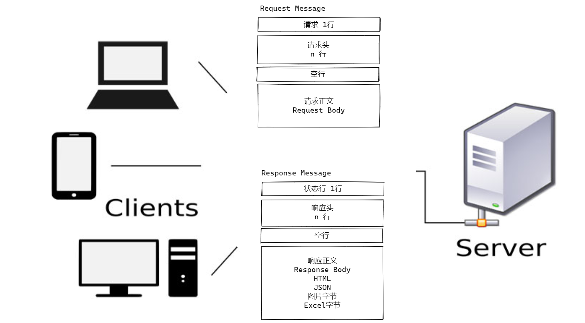
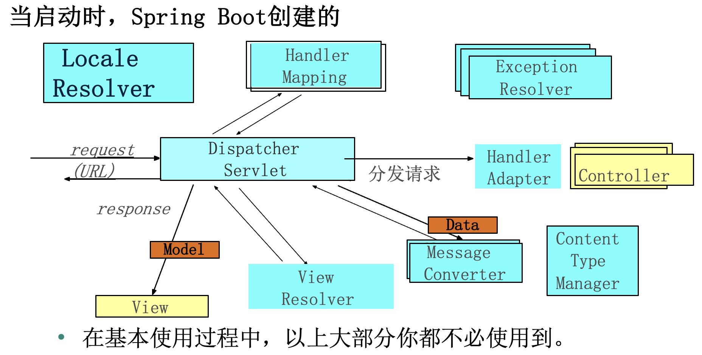
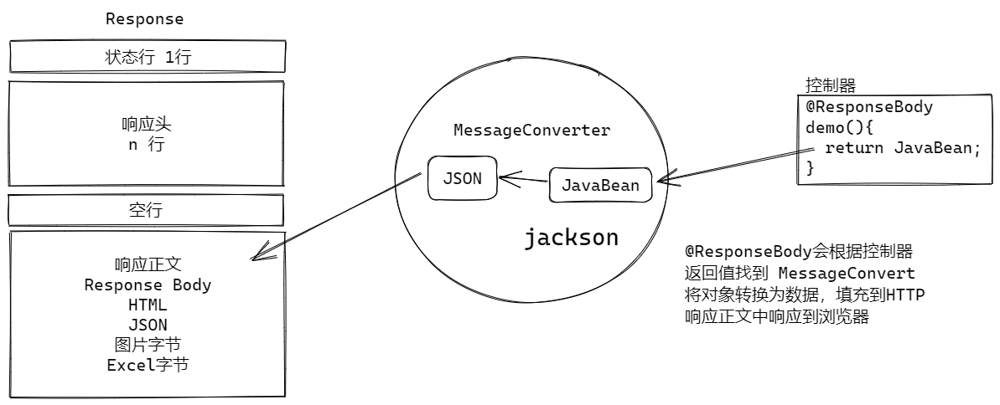
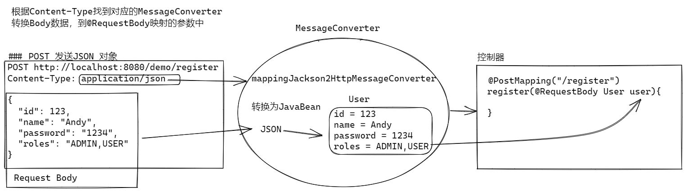
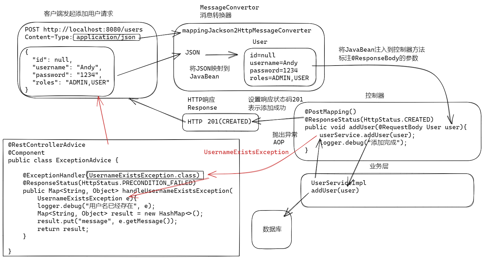
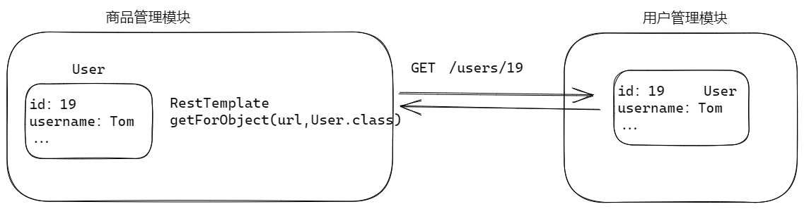
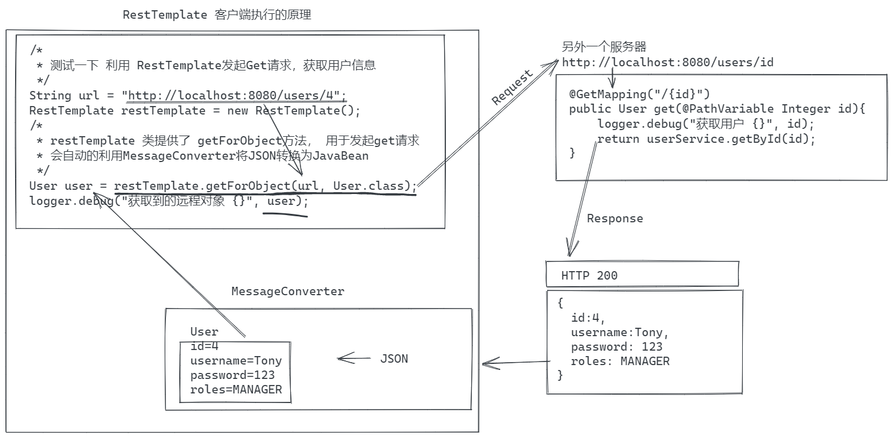
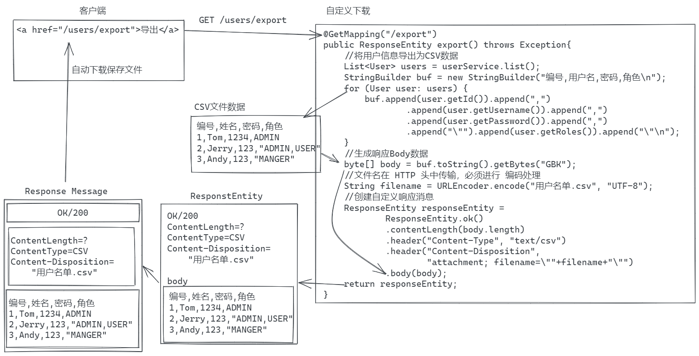
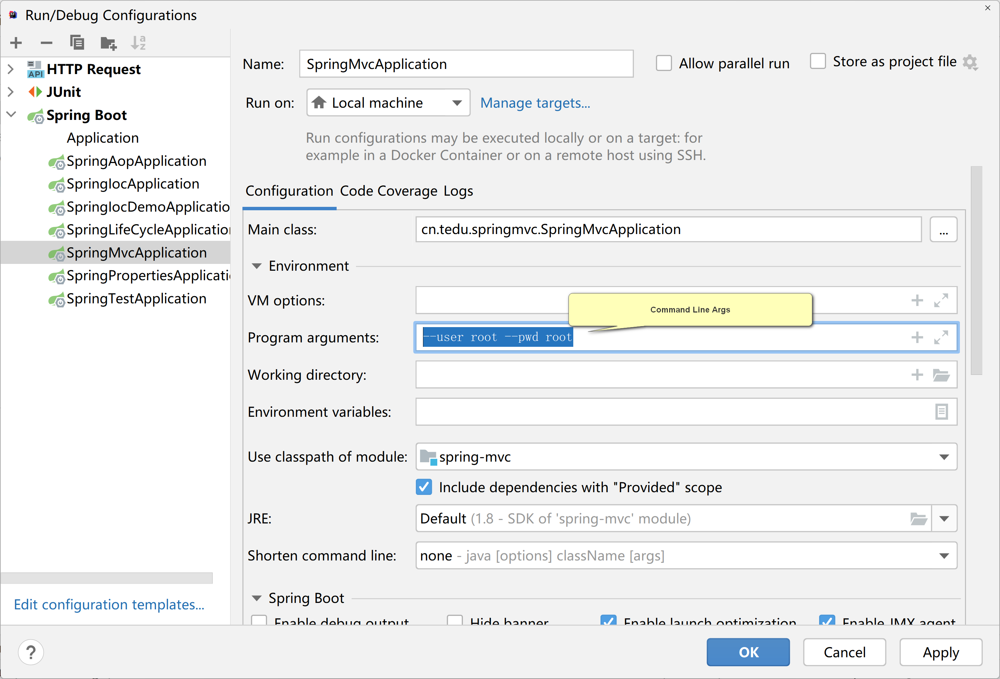
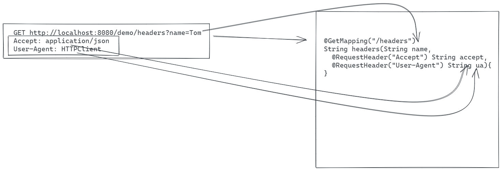

# SpringMVC 和 RESTFul

## Spring MVC

### 什么是Spring MVC

它的正式名称 "Spring Web MVC "来自其源模块的名称（spring-webmvc），但它更多地被称为 "Spring MVC"。

Spring MVC是MVC模式的Web框架，提供了一整套Web编程的组件，可以轻松方便的处理Web请求。

1. MVC 是常用用户界面设计模式： Swing 是MVC模式的， IOS界面是MVC的, Spring WEB MVC
2. SUN 建议web界面上采用MVC模式
3. 开源社区开发多套Web MVC框架
   1. Struts1
   2. Struts2（WebWorks）
   3. Spring MVC（Spring web MVC）

MVC 组件概述？说说什么是MVC？你理解MVC是什么？

- 是一种经典的用户界面设计模式（设计套路）。

- M Model  模型， 就是业务模型， 一般使用业务层+数据层作为业务模型，负责处理业务逻辑，管理业务数据。

- V View 视图，就是用户界面， 负责呈现业务数据， 接受用户请求 常用的View包括：Vue、JSP、Thymeleaf

- C Controller 控制器， 负责处理用户的请求，根据请求调用业务模型，再根据业务处理结果，选择合适的view

## HTTP 协议




## Spring MVC 常见面试题目

  


Spring MVC的五大组件 -- **面试考点**

- DispatcherServlet -- 前端控制器，Spring MVC 是围绕前端控制器设计的，即DispatcherServlet，简单理解：Spring MVC 所有功能都封装在DispatcherServlet中。
- HandlerMapping  -- 映射处理器，用于处理将一个请求映射到对应的控制器程序。主要的HandlerMapping实现是RequestMappingHandlerMapping（支持@RequestMapping注解的方法）
- Controller 控制器（需要编写），用于处理请求功能的程序，由DispatcherServlet，根据HandlerMapping的映射结果执行，控制器的处理结果是ModelAndView，或者最终被封装为ModelAndView。
  - 如果返回 @ResponseBody 则使用MessageConverter处理响应结果

- ModelAndView  -- 模型和视图，代表一个由**控制器**返回的模型和视图。视图是字符串视图名称。模型是一个Map，包含需要在视图上显示的数据。
- ViewResolver  -- 视图解析器，将**控制器**返回的视图名称解析为实际的视图，并将其渲染到响应。

SpringMVC处理请求的过程 -- **面试考点**

1. 请求由DispatcherServlet开始处理
2. DispatcherServlet调用HandlerMapping进行解析，找到url映射的Controller
3. DispatcherServlet调用Controller方法，处理请求
4. 由Controller返回ModelAndView对象给DispatcherServlet，其中封装了视图和数据
5. DispatcherServlet调用ViewResovler，解析视图进行视图渲染，之后，反馈给用户
   1. 如果控制器返回 返回 @ResponseBody 则使用MessageConverter处理响应结果


## SpringMVC中的常用注解

笔试题点/面试题 中经常出现

1. @Controller 控制器：用于配合组件扫描（@ComponentScan）创建控制器对象，常与@RequestMapping注解结合使用，其元注解包括@Component
2. @RestController  Rest控制器: 一个方便的注解，它元注解有@Controller和@ResponseBody注解。
3. @ResponseBody 响应体/响应正文:  表明控制器方法的返回值绑定到HTTP响应体。
    - 使用@ResponseBody后，不再调用ModelAndView以及视图解析器，而会自动调用MessageConverter, 将返回的数据转换为某种特定格式（json，xml），装入响应体
4. @RequstMapping 请求映射：使用@RequestMapping注解来映射请求到控制器方法
    - 这个注解可以在类和方法级别上使用。
    - 在方法层面上，应用程序将倾向于使用HTTP方法特定的变体之一@GetMapping、@PostMapping、@PutMapping、@DeleteMapping或@PatchMapping。
5. @GetMapping Get请求映射：用于将HTTP GET请求映射到特定的处理方法的注解。
    - @GetMapping是组合注解，是@RequestMapping(method = RequestMethod.GET)的快捷方式。
6. @PostMapping Post请求映射 用于将HTTP POST请求映射到特定的处理方法的注解。
    - @GetMapping是组合注解，是@RequestMapping(method = RequestMethod.POST)的快捷方式。
7. @RequestBody 请求实体， 标注在方法参数上，表示网络请求正文映射到丰富参数。
    - 请求的主体通过一个HttpMessageConverter来解析方法参数。经常用于讲将json数据转换存储到参数对象中。
8. @RequestParam 请求参数：将请求参数映射到控制器的方法参数上
9. @PathVariable 路径变量：将请求路径上“**URI模版**”映射到控制器的方法参数上
10. @ResponseStatus 响应状态: 设定HTTP响应状态码
11. @RequestHeader 请求头：映射请求头到控制器方法参数

### HttpMessageConverter


SpringBoot自动配置好的
配置的信息转换器有：

- stringHttpMessageConverter： 处理 @ResponseBody 返回 String 时候的响应结果
- mappingJackson2HttpMessageConverter， 处理 @ResponseBody 返回JavaBean， 将JavaBean转换为JSON

案例：找出系统带来的HttpMessageConverter
```java
@SpringBootTest
public class MessageConverterTests {

    Logger logger = LoggerFactory.getLogger(MessageConverterTests.class);

    @Autowired
    ApplicationContext context;

    @Test
    void messageConverter(){
        //从Spring 中获取全部 HttpMessageConverter 类型的JavaBean对象
        String[] names = context.getBeanNamesForType(HttpMessageConverter.class);
        for (String name:names) {
            logger.debug("{}", name);
        }
    }
}
```

### 使用 spring-boot-starter-web 配置Spring MVC

SpringBoot自动配置的内容

- 设置一个DispatcherServlet
- 设置内部配置以支持控制器，如： handlerMapping ViewResolver
- 设置默认的资源位置（images, CSS, JavaScript）
   - 可以使用 spring.resources.static-locations 属性 重新设置新的静态资源位置
- 设置默认的MessageConverters
   - message converter 可以自行扩展！如Excel下载的MessageConverter
- 还有更多，更多

### 常用注解映射参数的三种方式

#### 映射请求参数

get请求参数在请求行中：

```http
GET http://localhost:8080/demo/getparam?username=Tom&password=123&goto=Beijing
Accept: application/json
```
post请求表单传参，在请求Body中：

```http
POST http://localhost:8080/demo/postparam
Content-Type: application/x-www-form-urlencoded

username=Tom&password=123&goto=Beijing
```

控制器中接受键值对参数需要使用注解@RequestParam: 
- 不添加 @RequestParam 是可选参数，参数名称和请求参数名称一致就可以接收数据
- 添加 @RequestParam 后，默认属性是必须参数， 没有参数则出现异常
- @RequestParam 可以使用属性名称， 映射特殊参数名称，比如goto
    - goto 是Java关键字， 不能作为变量名称
```java
@GetMapping("/getparam")
public String getparam(String username,
        @RequestParam String password,
        @RequestParam("goto") String target){
    logger.debug("{}, {}, {}", username, password, target);
    return "OK";
}

@PostMapping("/postparam")
public String postparam(String username,
@RequestParam String password,
@RequestParam("goto") String target){
    logger.debug("{}, {}, {}", username, password, target);
    return "OK";
} 
```

> 若请求中的key与参数列表的参数名称一致，则该注解可以省略

#### 映射请求路径中的变量

请求路径中包含参数：http://localhost:8080/demo/users/5

控制器从路径中获取参数，通过使用注解@PathVariable来提取，该注解作用于参数列表的参数前
- 若uri模板{}中的名称与参数名称相同，则注解参数可以省略

path 路径  variable 变量

```java    
@GetMapping("/users/{id}") //使用 {名称} 定义占位符
public String pathValue(@PathVariable("id") Integer uid){
    logger.debug("uid {}", uid);
    return "OK";
}
```

客户端：
```http
GET http://localhost:8080/demo/users/5
Accept: application/json
```

#### 映射JSON对象

@RequestBody 请求实体

讲JSON数据作为请求Body，提交到控制器，控制器使用@RequestBody接收请求参数。@RequestBody是利用MessageConverter将JSON转化为JavaBean对象。



控制器：
```java
@PostMapping("/register")
public String register(@RequestBody User user){
    logger.debug("user {}", user);
    return "OK";
}
```

测试： ### 向服务器发送JSON对象
```http
POST http://localhost:8080/demo/register
Content-Type: application/json

{
  "id": 123,
  "name": "Andy",
  "password": "1234",
  "roles": "ADMIN,USER"
}
```
> 注意: JSON的Content-Type类型：application/json

## RestFul编程

### 什么是RestFul

RestFul 简称 Rest（表述性状态传递）

RESTFUL是一种Web应用程序的设计风格和开发方式，基于HTTP协议 -- 支持很多请求方式 - get，post，put，delete....

- GET 获取

- PUT 放进去
- POST 提交
- DELETE 删除

http://doc.canglaoshi.org/rfc/rfc2616.txt

```text
5.1.1 Method

   The Method  token indicates the method to be performed on the
   resource identified by the Request-URI. The method is case-sensitive.

       Method         = "OPTIONS"                ; Section 9.2
                      | "GET"                    ; Section 9.3
                      | "HEAD"                   ; Section 9.4
                      | "POST"                   ; Section 9.5
                      | "PUT"                    ; Section 9.6
                      | "DELETE"                 ; Section 9.7
                      | "TRACE"                  ; Section 9.8
                      | "CONNECT"                ; Section 9.9
                      | extension-method
       extension-method = token
```


核心思想，通过标准HTTP请求方法来表明进行的操作

- 新增 -- 发起POST请求
- 删除 -- 发起DELETE请求
- 修改 -- 发起PUT请求
- 查询 -- 发起GET请求

传统HTTP URL风格：

~~~java
@RequestMapping("/user/addUser")
void addUser(..){..}

@RequestMapping("/user/deleteUser")
void deleteUser(..){..}

@RequestMapping("/user/findUserById")
void findUserById(..){..}

@RequestMapping("/user/updateUser")
void updateUser(..){..}
~~~

RESTFul推荐的方案：

```java
@PostMapping("/users")
@RequestBody
void addUser(..){..}

@DeleteMapping("/users/{uid}")
void deleteUser(Integer uid){..}

@GetMapping("/users/{uid}")
void findUserById(Integer uid){..}

@PutMapping("/users/{uid}")
@RequestBody
void updateUser(Integer uid){..}
```

> Elasticsearch 中严格遵守RESTFul


#### RESTFul 请求与响应状态码

@ResponseStatus 响应状态: 设定HTTP响应状态码

| 功能 | 请求类型 | 请求数据 | 控制器方法注解 | 响应状态码               |
| ---- | -------- | -------- | -------------- | ------------------------ |
| 新增 | POST     | JSON     | @PostMapping   | 201(CREATED)创建了       |
| 删除 | DELETE   | URL      | @DeleteMapping | 204(NO_CONTENT) 没有内容 |
| 修改 | PUT      | JSON     | @PutMapping    | 204(NO_CONTENT) 没有内容 |
| 查询 | GET      | URL      | @GetMapping    | 200（OK）正常            |

> RESTFul请求参数一般是通过请求Body发送的JSON数据。控制器中使用@RequestBody接收参数

关于RESTFul

- 上述是标准的RestFul 用法！
- 很多企业为了方便，只使用 get 和 post
- 关于状态码，上述是建议的标准状态码，正常 200 201 204 ，错误返回 4xx 5xx
- 很多企业，都使用200作为返回状态， 利用JSON封装自己的错误号码。

添加用户信息：



```java
@PostMapping()
@ResponseStatus(HttpStatus.CREATED)
public void addUser(@RequestBody User user){
    userService.addUser(user);
    logger.debug("添加完成");
}
```
测试：### Rest 添加用户
```http
POST http://localhost:8080/users
Content-Type: application/json

{
  "id": null,
  "username": "Andy",
  "password": "1234",
  "roles": "ADMIN,USER"
}
```

获取用户信息：
```java
@GetMapping("/{id}")
public User get(@PathVariable Integer id){
    logger.debug("获取用户 {}", id);
    return userService.getById(id);
}
```
```java
@GetMapping
public List<User> list(){
    List<User> list = userService.list();
    return list ;
}
```
测试：### Rest 获取用户1信息
```http
GET http://localhost:8080/users/1
Accept: application/json
```

  Rest 获取用户2信息

```http
GET http://localhost:8080/users/2
Accept: application/json
```

 REST 获取全部用户信息

```http
GET http://localhost:8080/users
Accept: application/json
```


更新用户信息：

```java
@PutMapping
@ResponseStatus(HttpStatus.NO_CONTENT)
public void updateUser(@RequestBody User user){
    userService.update(user);
}
```
测试：修改用户信息
```http
PUT http://localhost:8080/users
Content-Type: application/json

{
  "id": 1,
  "username": "Tom",
  "password": "1234789",
  "roles": "ADMIN,USER"
}
```

删除用户信息:
```java
@DeleteMapping("/{id}")
@ResponseStatus(HttpStatus.NO_CONTENT) //没有内容
public void delete(@PathVariable Integer id){
    userService.delete(id);
}
```

客户端：Rest 删除用户
```http
DELETE http://localhost:8080/users/9
Accept: application/json
```

错误处理：
```java
@RestControllerAdvice //REST控制器通知，用于异常处理
@Component
public class ExceptionAdvice {

    Logger logger= LoggerFactory.getLogger(ExceptionAdvice.class);

    @ExceptionHandler(UserNotFoundException.class)
    @ResponseStatus(HttpStatus.NOT_FOUND)
    public Map<String, Object> handleUserNotFoundException(UserNotFoundException e){
        logger.debug("用户信息找到",e);
        Map<String, Object> result = new HashMap<>();
        result.put("message", e.getMessage());
        return result;
    }

    @ExceptionHandler(UsernameExistsException.class)
    @ResponseStatus(HttpStatus.PRECONDITION_FAILED)
    public Map<String, Object> handleUsernameExistsException(UsernameExistsException e){
        logger.debug("用户名已经存在", e);
        Map<String, Object> result = new HashMap<>();
        result.put("message", e.getMessage());
        return result;
    }

}
```

### RestTemplate 客户端

RestTemplate Reat模板

Template 设计模式， 模板设计模式：将负责的业务流程进行封装， 自需要使用很少添加代码就可以而完成复杂逻辑，Thread 类是最典型的模板设计模式！！！

RestTemplate 客户端: 是Spring 提供的用于作为Rest客户端，调用Rest接口的API, 往往用于整合业务组件， 从一个模块调用另外一个模块的数据。



- 用于在向其他服务发起请求的，用法和TestRestTemplate一样
    - 用于服务之间发起和接受请求，提供了支持restful的各种方法
    - 支持使用RequestEntity和ResponseEntity，支持发送自定义请求，接受自定义响应
- @RequestHeader -- 讲题的时候说

| **HTTP** **Method** | **RestTemplate** **Method**                                  |
| ------------------- | ------------------------------------------------------------ |
| **DELETE**          | delete(String url, Object… urlVariables)                     |
| **GET**             | getForObject(String url,  Class<T> responseType, Object… urlVariables) |
| **HEAD**            | headForHeaders(String url,  Object… urlVariables)            |
| **OPTIONS**         | optionsForAllow(String url,  Object… urlVariables)           |
| **POST**            | postForLocation(String url,  Object request, Object… urlVariables) |
|                     | postForObject(String url, Object request, Class<T> responseType, Object… uriVariables) |
| **PUT**             | put(String url, Object request, Object… urlVariables)        |
| **PATCH**           | patchForObject(String url, Object request, Class<T> responseType, Object… uriVariables) |

>  RestTemplate 和 TestRestTemplate 没有继承关系

getForObject的原理：



```java
@SpringBootTest
public class RestTemplateTests {
    private static final Logger log = LoggerFactory.getLogger(RestTemplateTests.class);

    @Test
    void test(){
        /*
         * 使用RestTempalte 访问其他的Rest API
         */
        RestTemplate restTemplate = new RestTemplate();
        //利用restTemplate发起get请求，返回值JSON自动转换为User.class类型对象
        User user = restTemplate.getForObject("http://localhost:8080/users/19", User.class);
        log.debug("User {}", user);
        //delete() 发起 DELETE 请求
        //put() 发起PUT请求
        //postForObject() 发起 post请求
    }

}
```


## ResponseEntity 创建自定义响应

大部分情况，Spring MVC都能很好的自动处理 HTTP 响应，但是如果需要向浏览器发送自定义响应时候，就可以使用ResponseEntity 定义任意的HTTP响应。



比如：文件下载

- 使用ResponseEntity对象，可以处理响应体，响应头，响应状态码
- ResponseEntity的优先级高于@ResponseBody 和 @ResponseStatus

csv文件下载案例：

```java
/**
 * 实现csv文件导出功能
 * 使用浏览器测试： http://localhost:8080/users/export
 */
@GetMapping("/export")
public ResponseEntity export() throws Exception{
    //将用户信息导出为CSV数据
    List<User> users = userService.list();
    StringBuilder buf = new StringBuilder("id,username,password,roles\n");
    for (User user: users) {
        buf.append(user.getId()).append(",")
        .append(user.getUsername()).append(",")
        .append(user.getPassword()).append(",")
        .append("\"").append(user.getRoles()).append("\"\n");
    }
    //生成响应Body数据
    byte[] body = buf.toString().getBytes("GBK");
    //文件名在 HTTP 头中传输，必须进行 编码处理
    String filename = URLEncoder.encode("用户名单.csv", "UTF-8");
    //创建自定义响应消息
    ResponseEntity responseEntity =
    	ResponseEntity.ok()
        .contentLength(body.length)
        .header("Content-Type", "text/csv")
        .header("Content-Disposition",
        "attachment; filename=\""+filename+"\"")
        .body(body);
    return responseEntity;
}
```

关于CSV文件：

```csv
编号,姓名,密码,角色 
1,Tom,1234,ADMIN
2,Jerry,123,"ADMIN,USER"
3,Andy,123,"MANGER"
```


### Spring SpringBoot SpringMVC Tomcat  的关系

- Spring 特指Spring 框架， 是Spring 全家桶的基础，可以单独使用，包含IOC/DI 、AOP 基本功能，需要使用复杂配置文件，配置复杂
- Tomcat 是可以独立使用Web服务器，需要编写Servlet / JSP，繁琐的Web开发
- Spring MVC，基于Spring和Tomcat，提供简化Web开发，但是配置复杂繁琐
- Spring Boot，在 Spring、Tomcat、Spring MVC 等基础上，提供了自动化配置功能，简化配置和开发。
    - 只要在Spring Boot 中引入 spring-boot-starter-web后，就会：
        - 自动配置 Spring
        - 自动导入配置Tomcat
        - 自动配置 Spring MVC （5大组件）

## Spring 命令行的支持 

Spring 提供了 命令行 应用程序的支持：

- CommandLineRunner
  - 不提供命令行参数语法解析， 使用繁琐
- ApplicationRunner
  - 提供了命令行参数解析功能， 可以将参数  --user=root --pwd=root 解析为一个map
  - 必须按照 ApplicationRunner 要求的方式设置命令行参数
  - https://docs.spring.io/spring-boot/docs/current/api/org/springframework/boot/ApplicationArguments.html

实现了这个两个接口以后， 启动Spring 应用程序时候， 会自动执行正两对象。

可以在访问Spring的一切资源， 包括注入JavaBean对象。

```java
@Component
public class CommandBean implements CommandLineRunner {

    Logger logger = LoggerFactory.getLogger(CommandBean.class);

    /**
     * Spring 启动时候可以自动执行 run 方法
     * @param args
     * @throws Exception
     */
    @Override
    public void run(String... args) throws Exception {
        logger.debug("执行了程序！收到参数{}", Arrays.toString(args));
        //args 可以接受命令行参数
        //手工解析 命令行参数
    }
}
```


```java
@Component
public class ApplicationBean implements ApplicationRunner {
    Logger logger = LoggerFactory.getLogger(ApplicationBean.class);

    @Autowired
    UserService userService;

    @Override
    public void run(ApplicationArguments args) throws Exception {
        logger.debug("启动执行，提供了解析以后的参数：{}", args.getOptionNames());
        List<User> users = userService.list();
        users.forEach(user -> {logger.debug("{}", user);});
    }
}
```




## RequestHeader

映射请求头到控制器方法参数：



```java
@GetMapping("/headers")
public String headers(String name,
                      @RequestHeader("Accept") String accept,
                      @RequestHeader("User-Agent") String ua){
    logger.debug("{}，{}，{}", name, accept, ua);
    return "OK";
}
```

测试：

```http
GET http://localhost:8080/demo/headers?name=Tom
Accept: application/json
User-Agent: HTTPClient
```


