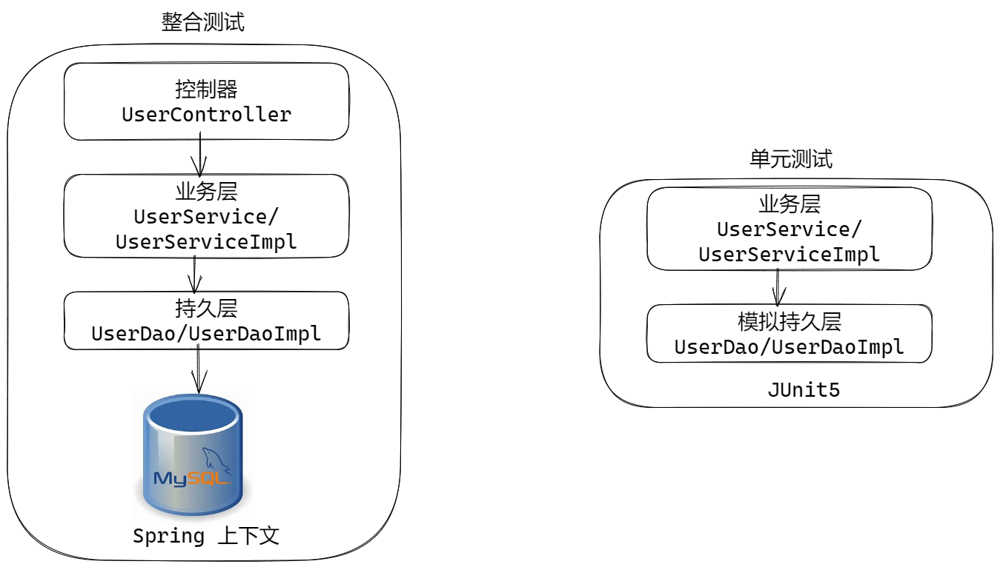
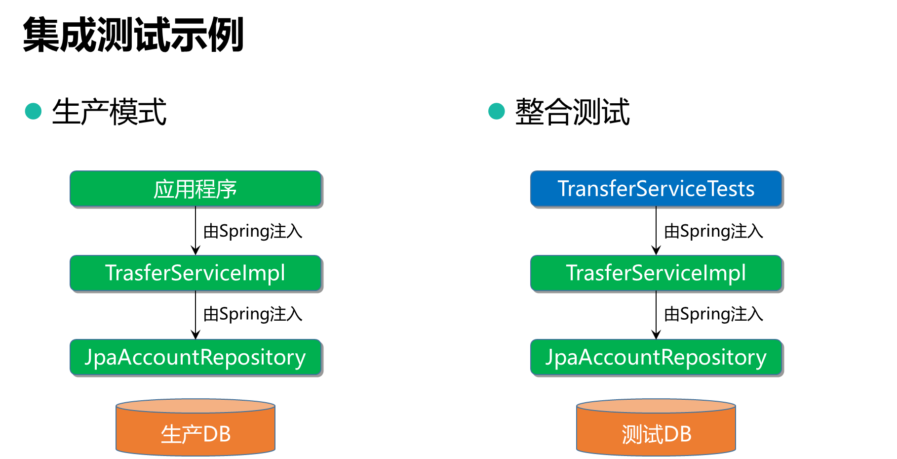
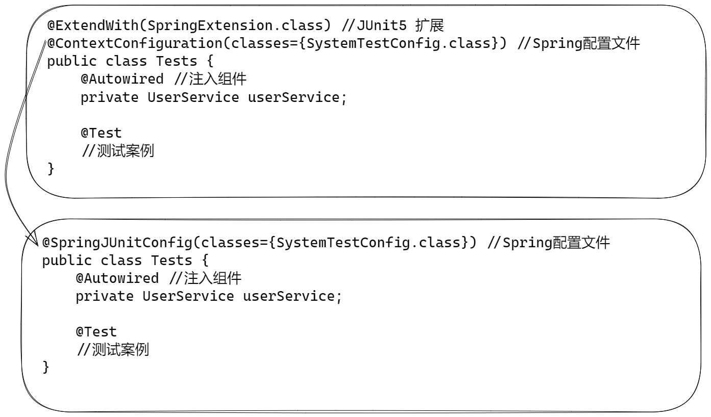
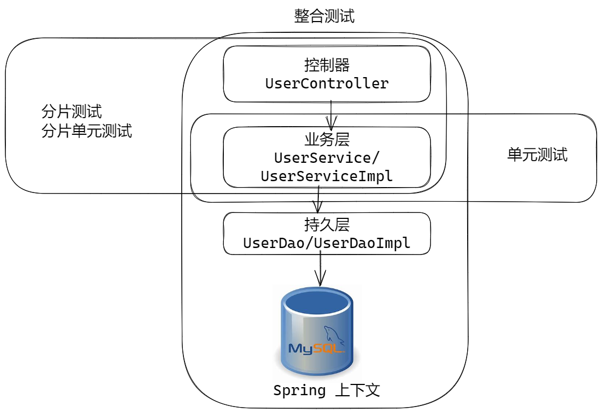
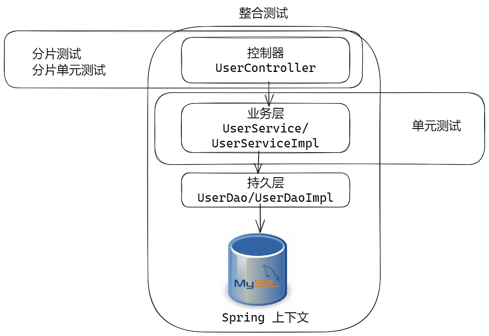
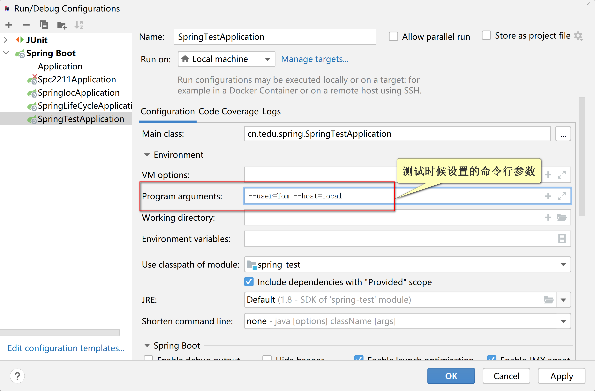

# Unit03 Spring 测试和 Spring Boot测试

## 单独使用JUnit5 


Spring 和 Spring Boot 提供的测试功能，是整合JUnit5实现的。

Spring Boot内嵌了JUnit5 ，导入Spring Boot依赖，就会自动导入JUnit5.

JUnit5 官方:  https://junit.org/

JUnit5 是最常用的Java测试框架，可以单独使用：

案例：
```java
public class Junit5Tests {
    /**
     * 在全部测试案例之前执行，初始化全局资源, 方法必须是静态的
     * Before 在xxx之前，All 全部，
     */
    @BeforeAll
    static void beforeAll(){
        System.out.println("Junit5Tests.beforeAll");
    }

    /**
     * 在每一个测试案例之前执行，用于初始化每个案例的上下文
     * Before 在xxx之前，Each 每一个
     */
    @BeforeEach
    void beforeEach(){
        System.out.println("Junit5Tests.beforeEach");
    }

    /**
     * 在全部测试案例执行完成以后执行，销毁全局资源，静态方法
     * After 在xxx之后，all全部
     */
    @AfterAll
    static void afterAll(){
        System.out.println("Junit5Tests.afterAll");
    }

    /**
     * 在每个案例执行完成以后执行，用于回收资源
     */
    @AfterEach
    void afterEach(){
        System.out.println("Junit5Tests.afterEach");
    }
    /**
     * @Test 用于定义测试案例
     */
    @Test
    void test(){
        System.out.println("Hello World!");
    }
    @Test
    void demo(){
        System.out.println("Hello Demo!");
    }
}
```

## 使用JUnit5 进程单元测试

- 单元测试： 脱离Spring的环境，只是对软件的组件进行的测试成为单元测试，比如对业务层进程测试
  - 单元测试时候，可以手动创建数据层测试组件，或者利用模拟框架实现数据层
- 集成测试： 依赖Spring上下文环境，对软件的多个层次进程测试



Mock 模拟，欺骗

Mockito 是Java单元测试模拟框架， 可以用于创建各种模拟对象， 模拟对象的行为

官网：https://site.mockito.org/

使用步骤：

- 基于接口创建模拟对象， 用于替换实际实现的对象, 底层是JDK 动态代理实现
  - 如果实现数据层接口，替换数据层对象。
- 通过训练，模拟接口的行为。 

利用模拟框架，创建模拟userDao对象：

```java
public class MockTests {
    Logger logger = LoggerFactory.getLogger(MockTests.class);
    UserDao userDao;
    @Test
    void mock(){
        /*
         * 利用 Mockito 框架，创建模拟的对象
         */
        userDao = Mockito.mock(UserDao.class);
        logger.debug("模拟对象 {}", userDao.getClass());

        /*
         * 调用模拟对象的方法，没有”训练“的模拟对象，默认都是空方法
         */
        User user = userDao.findUserByName("Tom");
        logger.debug("训练前 {}", user);
        /*
         * 对模拟对象进行训练，增加简单功能
         * when: 在xxx时候
         * 在执行 findUserByName("tom") 时候, 返回一个新User对象
         */
        Mockito.when(userDao.findUserByName("Tom"))
                .thenReturn(new User(1,"Tom","123","ADMIN"));
        /*
         * 再次调用findUserByName，得到训练后的对象
         */
        user = userDao.findUserByName("Tom");
        logger.debug("训练后 {}", user);
    }
}
```

利用模拟的对象进行单元测试：
```java
package cn.tedu.spring.junit;

import cn.tedu.spring.dao.UserDao;
import cn.tedu.spring.entity.User;
import cn.tedu.spring.service.UserService;
import cn.tedu.spring.service.impl.UserServiceImpl;
import org.junit.jupiter.api.BeforeEach;
import org.junit.jupiter.api.Test;
import org.slf4j.Logger;
import org.slf4j.LoggerFactory;

import static org.mockito.Mockito.*;

/**
 * 脱离数据库，对业务层进程测试
 */
public class UnitTests {
    Logger logger = LoggerFactory.getLogger(UnitTests.class);
    UserService userService;
    UserDao userDao;
    /**
     * 在执行测试方法之前，对userService进程初始化
     */
    @BeforeEach
    void init(){
        logger.debug("创建userDao模拟对象，并且训练行为");
        //创建userDao模拟对象，并且训练行为
        userDao = mock(UserDao.class);
        when(userDao.findUserByName("Tom"))
                .thenReturn(new User(1, "Tom", "123", "ADMIN"));
        //使userService依赖模拟的userDao对象，不依赖数据库
        UserServiceImpl userService = new UserServiceImpl();
        userService.setUserDao(userDao);
        this.userService = userService;
    }
    @Test
    void login(){
        User user = userService.login("Tom", "123");
        logger.debug("登录结果{}", user);
    }
}

```

## 使用断言进行自动化测试

对测试结果进行人工逐一核对是及其繁琐的！！！

断言: 在程序运行期期间，断定得到的数据/变量的值，必然是某个数值。如果是则通过检查，如果不是则抛出异常！

利用断言核查大量运算结果，具有快速高效，自动化的优势。

- 断言(assertion)是一种在程序中的一阶逻辑(如：一个结果为真或假的逻辑判断式)，
- 目的为了表示与验证软件开发者预期的结果——当程序执行到断言的位置时，对应的断言应该为真。
- 若断言不为真时，程序会中止执行，并给出错误信息。
- 测试中可以利用断言检查测试结果是否与预期结果一致，实现自动测试功能

先导入断言包：
```java
import static org.junit.jupiter.api.Assertions.*;
```
然后测试：
```java
@Test
void login() {
    //创建业务层对象
    UserServiceImpl userService = new UserServiceImpl();
    //业务层对象注入模拟对象
    userService.setUserDao(userDao);
    User user = userService.login("Tom", "1234");
    //利用断言检查用户名是否为 Tom，如果一致就继续运行，不一致就出错误！
    assertEquals("Tom", user.getUsername());
    //利用断言检查登录失败的情况
    //assertThrows 断言抛出异常，断定后续代码一定抛出UserNotFoundException
    assertThrows(UserNotFoundException.class, () -> {
        //Jerry登录时候，没有对应对象，就会发生UserNotFoundException异常
        userService.login("Jerry", "111");
    });
    assertThrows(PasswordErrorException.class, () -> {
        userService.login("Tom", "123");
    });
    //空参数异常
    assertThrows(IllegalParameterException.class,()->{
        userService.login("", "");
    });
    assertThrows(IllegalParameterException.class,()->{
        userService.login("Tom", "");
    });
}
```

## Spring + JUnit5 集成测试 （了解）



- Spring 2.2 开始支持JUnit5
- 需要依赖Jar spring-test.jar
- 提供了扩展注解 @ContextConfiguration
- 合成组件@SpringJUnitConfig



## Spring Boot 集成测试

集成测试：控制器->业务层->持久层 测试


添加依赖：
```xml
<dependency>
    <groupId>org.springframework.boot</groupId>
    <artifactId>spring-boot-starter-test</artifactId>
    <scope>test</scope>
</dependency>
```

依赖了哪些组件：
- JUnit：默认的版本是JUnit 5（从Spring Boot 2.2版本开始）
- Spring Test和Spring Boot Test：测试注解
- AssertJ：一个断言库
- Hamcrest：一个匹配库
- Mockito：一个Java模拟框架
- JSONAssert：一个用于JSON的断言库
- JsonPath：用于JSON的XPath

## 对 Spring MVC 测试



@SpringBootTest 注解：
- 标注在测试类上，自动搜索 @SpringBootConfiguration 注解，创建Spring上下文
  - 也就是说@SpringBootTest会自动搜索Spring配置类

- @SpringBootTest 是@ContextConfiguration的替代方案
  - @ContextConfiguration需要指定配置类
  - @SpringBootTest 也可以指定配置类
  - 是组合注解，元注解包括@ExtendWith（从Spring Boot 2.2开始）

- @SpringBootTest 用于**集成测试**，@ContextConfiguration 用于**分片测试**
- @SpringBootTest注解属性webEnvironment 支持多种测试模式：
  - RANDOM_PORT, DEFINED_PORT, MOCK, NONE（- 随机端口，定义端口，模拟，无） 
  - @SpringBootTest 可以进行Web应用测试， web应用服务器启动时候，一般占用8080，测试程序如果也使用8080端口，肯定出现端口绑定异常。 使用随机端口参数，就可以避免这个异常。
- 测试框架自动启动嵌入式Web服务器，可以自动启动
- 自动配置一个TestRestTemplate 组件
  -  TestRestTemplate 可以自动找到随机端口，对控制器进行测试
  - TestRestTemplate 提供了控制器测试方法


简单理解： @SpringBootTest  = @ExtendWith + @ContextConfiguration

创建测试类, 指定随机端口：
```java
import static org.springframework.boot.test.context.SpringBootTest.WebEnvironment.*;

@SpringBootTest(webEnvironment = RANDOM_PORT)
public class UserControllerTests {

    Logger logger = LoggerFactory.getLogger(UserControllerTests.class);

    @Autowired
    TestRestTemplate restTemplate;

    @Test
    void test(){
        logger.debug("Hello World");
    }
}
```
控制台：
```text
Tomcat started on port(s): 59640 (http) with context path ''
```

### TestRestTemplate 进程集成测试

- TestRestTemplate 和 RestTemplate 都是Spring 提供的HTTP客户端
- TestRestTemplate提供了便捷的HTTP请求方法，可以用来发起任意的HTTP请求
  - get请求测试
  - post请求测试
  - delete请求
  - put请求
  - 自定义请求

- TestRestTemplate是适用于集成测试的RestTemplate的替代品
  - TestRestTemplate 用于集成测试，（无法指定端口号）使用相对路径发请求
  - RestTemplate 用于发起HTTP远程调用
  - TestRestTemplate 采取相对路径（而不是绝对路径）发起http请求
  - 容错性：当从服务器应用程序收到404等错误响应时，TestRestTemplate不会抛出一个异常, 这样更方便自动化测试

- TestRestTemplate配置为忽略cookies和重定向，也是为了便于测试

> TestRestTemplate 和 RestTemplate 之间没有任何的继承关系

准备测试控制器：

```java
@RestController
@RequestMapping("/demo")
public class DemoController {

    @GetMapping("/hello")
    public String hello(){
        return "Hello World!";
    }
}
```

使用TestRestTemplate发起测试请求：
```java
@Test
void hello(){
    String message =  restTemplate.getForObject("/demo/hello", String.class);
    logger.debug("response : {} ", message);
    assertEquals("Hello World!", message);
}
```
相对与绝对路径：
- 相对路径： /demo/hello
- 绝对路径： http://localhost:8080/demo/hello

测试登录请求：
```java
@Test
void login(){
    String message = restTemplate.getForObject(
            "/users/login?username={0}&pwd={1}", String.class, "Tom", "1234");
    logger.debug("{}", message);
    assertEquals("登录成功！", message);
}
```

测试获取对象信息:
```java
@Test
void get(){
    User user = restTemplate.getForObject("/users/{id}", User.class, 1);
    logger.debug("{}", user);
    assertEquals("tom", user.getUsername());
}
```

## 使用MockMvc进程测试

TestRestTemplate 测试时候，必须启动内嵌的Web服务器，资源消耗较多，占用网络端口使用不够方便

Spring Boot 提供了 MockMvc 组件，用于模拟MVC测试， 可以实现不启动Web服务器的情况下进行模拟测试

使用步骤：

1. 在测试类上，设定MOCK（模拟）方式进程测试

   ```java
   @SpringBootTest(webEnvironment = WebEnvironment.MOCK)
   @AutoConfigureMockMvc
   ```

2. 设置模拟方式后就可以注入MockMvc组件进行模拟测试

   ```java
   @Autowired
   MockMvc mockMvc
   ```

3. 使用mockMvc的方法进行模拟测试

   ```java
   import static org.springframework.boot.test.context.SpringBootTest.WebEnvironment.MOCK;
   import static org.springframework.test.web.servlet.request.MockMvcRequestBuilders.*;
   import static org.springframework.test.web.servlet.result.MockMvcResultMatchers.*;
   
   @SpringBootTest(webEnvironment = MOCK)
   @AutoConfigureMockMvc
   public class HelloMockMvcTests {
       Logger logger = LoggerFactory.getLogger(HelloMockMvcTests.class);
       @Autowired
       MockMvc mockMvc;
   
       @Test
       void hello() throws Exception {
           mockMvc.perform(get("/demo/hello"))
                   .andExpect(status().isOk());
           logger.debug("OK");
       }
   }
   ```

## Web切片测试

上述测试 是 控制器 业务层 数据层 全部参与，组件多不方便确定问题点，如果希望对控制器或者业务层单独测试，可以利用”Web分片测试实现“。

**什么是“切片”测试？**




在应用程序的一个切片内执行独立的测试

- Web切片

- 存储库切片

- 缓存切片

各依赖项需要被模拟（Mock Bean）

### 使用 @MockBean 创建模拟组件

@MockBean Spring 提供的注解， 其作用可以创建模拟组件

```java
@SpringBootTest
public class MockBeanDemo {

    Logger logger = LoggerFactory.getLogger(MockBeanDemo.class);

    @MockBean
    UserService userService;

    @Test
    void testUserDao(){
        logger.debug("MockBean userDao {}", userService.getClass());
        //训练
        Mockito.when(userService.getById(1))
                .thenReturn(new User(1,"tom", "1234", "Admin"));

        //测试
        User user=userService.getById(1);
        logger.debug("测试结果 {}", user);
        Assertions.assertEquals("tom", user.getUsername());
    }
}
```

### **使用@WebMvcTest进行Web切片测试**

- 禁用全部自动配置，而只应用与MVC测试相关的配置

- 自动配置Mvc测试框架

  - MockMvc bean是自动配置的

  - 还有可选的Spring Security

- 通常情况下，@WebMvcTest与@MockBean结合使用，以模拟其依赖关系

```java
package cn.tedu.spring.controller;


import cn.tedu.spring.entity.User;
import cn.tedu.spring.service.UserService;
import org.junit.jupiter.api.Test;
import org.mockito.Mockito;
import org.slf4j.Logger;
import org.slf4j.LoggerFactory;
import org.springframework.beans.factory.annotation.Autowired;
import org.springframework.boot.test.autoconfigure.web.servlet.WebMvcTest;
import org.springframework.boot.test.mock.mockito.MockBean;
import org.springframework.http.MediaType;
import org.springframework.test.web.servlet.MockMvc;

import javax.annotation.PostConstruct;

import static org.springframework.test.web.servlet.request.MockMvcRequestBuilders.*;
import static org.springframework.test.web.servlet.result.MockMvcResultMatchers.*;

/**
 * @WebMvcTest 可以对 Web 层（控制器层）进程分片测试
 * 只测试控制器组件，其他组件一概不测试
 *  @WebMvcTest(被测试的组件)，Spring Boot 只创建UserController
 *  的Java bean，其他组件不创建
 *  UserController 依赖的组件，需要使用@MockBean创建模拟对象，
 *  Spring 会自动的将模拟对象，注入给 只创建UserController
 */
@WebMvcTest(UserController.class)
public class WebMvcTestsDemo {
    Logger logger = LoggerFactory.getLogger(WebMvcTestsDemo.class);

    /**
     * 利用@MockBean创建被UserController依赖的对象userService
     * @WebMvcTest 会自动的将userService注入给UserController
     */
    @MockBean
    UserService userService;

    @Autowired
    MockMvc mockMvc;

    /**
     * 训练userService的功能，为了测试控制器的功能
     */
    @PostConstruct
    void init(){
        //训练login方法，此方法是被 UserController login 调用的方法
        Mockito.when(userService.login("John", "1234"))
                .thenReturn(new User(1, "John", "1234", "ADMIN"));
        Mockito.when(userService.getById(2))
                .thenReturn((new User(2, "Andy", "12", "ADMIN")));
        logger.debug("完成训练！");
    }

    @Test
    void login() throws Exception{
        //URL 中{0}的参数占位符
        String url = "/users/login?username={0}&pwd={1}";
        mockMvc.perform(get(url,"John", "1234"))  //请求时候，进行参数替换
                .andExpect(status().isOk())
                .andExpect(content().string("登录成功！"));

        logger.debug("测试完成");
    }
    @Test
    void getUser() throws Exception{
        //URL 中{0}的参数占位符
        String url = "/users/{0}";
        mockMvc.perform(get(url, 2)) //请求时候，进行参数替换
                .andExpect(status().isOk())//检查返回的状态码
                .andExpect(content().contentType(MediaType.APPLICATION_JSON)) //检查contentType
                .andExpect(jsonPath("username").value("Andy"))//检查返回结果中 json 属性的值
                .andExpect(jsonPath("password").value("12"))
                .andExpect(jsonPath("roles").value("ADMIN"));
        logger.debug("测试完成");
    }

}
```


命令行参数：


